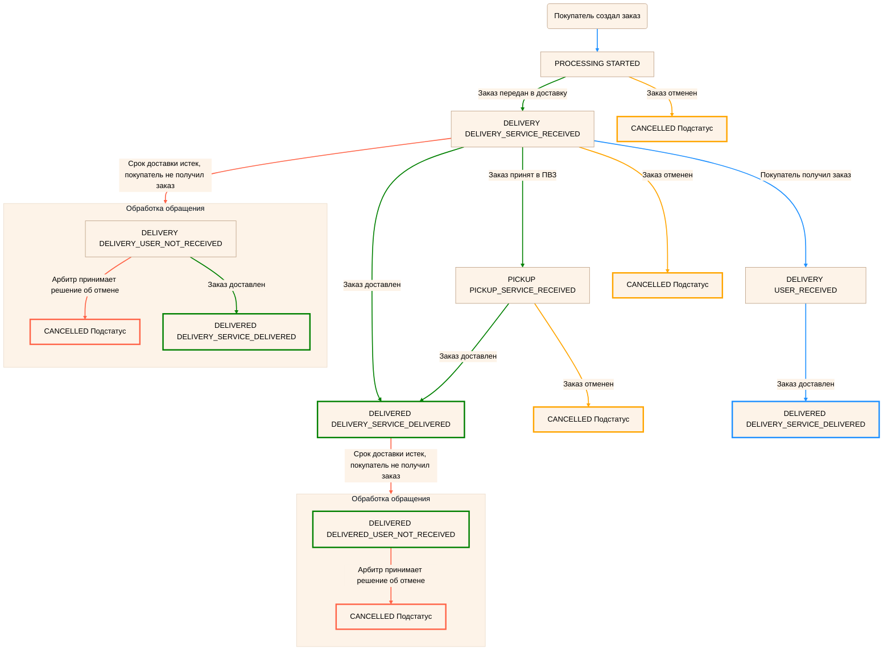

---
metadata:
  - name: generator
    content: Diplodoc Platform v5.61.1
alternate:
  - https://yandex.ru/dev/market/partner-api/doc/en/concepts/dbs-order-status-model.md
  - https://yandex.ru/dev/market/partner-api/doc/ru/concepts/dbs-order-status-model.md
  - https://yandex.ru/dev/market/partner-api/doc/zh/concepts/dbs-order-status-model.md
  - href: https://yandex.ru/dev/market/partner-api/doc/ru/concepts/dbs-order-status-model.md
    type: text/markdown
    title: Markdown version
  - href: https://yandex.ru/dev/market/partner-api/doc/ru/llms.txt
    rel: describedby
---
> **Documentation Index:** Fetch the complete configuration index at https://yandex.ru/dev/market/partner-api/doc/ru/llms.txt

# Как изменяются статусы заказов

Схема по изменению статусов показывает этапы, которые проходит DBS-заказ, и логику переходов между статусами. Это поможет соотнести статусы Маркета и вашей системы, корректно настроить интеграцию с Маркетом и не передавать лишние статусы и подстатусы.

**Обозначения:**

   * На схеме отражены статусы и подстатусы заказа на каждом этапе в формате `Статус Подстатус`. Например, `PROCESSING STARTED`.

      Список подстатусов `CANCELLED` смотрите в разделе [Подстатусы при отмене заказа](#cancelled-substatuses).

   * Стрелки показывают переходы между этапами, а их цвет — когда происходит этот переход:

      * зеленый — магазин изменил статус;
      * синий — Маркет изменил статус;
      * оранжевый — отмена заказа одной из сторон;
      * красный — исключительные случаи.



Иначе это приведет к ошибке.



<!-- source: ru/_includes/mermaid/dbs-order-status-graph.md -->

<!-- endsource: ru/_includes/mermaid/dbs-order-status-graph.md -->

## Расшифровка схемы {#details}

#|
|| **Статус, подстатус и описание этапа** | **Кто меняет статус** | **Методы, с помощью которых меняется статус или приходит информация о заказе в этом статусе** ||

|| `PROCESSING` 
`STARTED`

Магазин обрабатывает заказ. | Маркет |

[POST v1/businesses/{businessId}/orders](https://yandex.ru/dev/market/partner-api/doc/ru/reference/orders/getBusinessOrders.md)

[POST notification](https://yandex.ru/dev/market/partner-api/doc/ru/push-notifications/reference/sendNotification.md)
||

|| `DELIVERY` 
`DELIVERY_SERVICE_RECEIVED`

Заказ передан в доставку. | Магазин |

[POST v1/businesses/{businessId}/orders](https://yandex.ru/dev/market/partner-api/doc/ru/reference/orders/getBusinessOrders.md)

[POST notification](https://yandex.ru/dev/market/partner-api/doc/ru/push-notifications/reference/sendNotification.md)

[PUT v2/campaigns/{campaignId}/orders/{orderId}/status](https://yandex.ru/dev/market/partner-api/doc/ru/reference/orders/updateOrderStatus.md) ||

|| `DELIVERY` 
`USER_RECEIVED`

Покупатель получил заказ.

Передается только при работе через Яндекс Доставку.| Маркет |

[POST v1/businesses/{businessId}/orders](https://yandex.ru/dev/market/partner-api/doc/ru/reference/orders/getBusinessOrders.md)

[POST notification](https://yandex.ru/dev/market/partner-api/doc/ru/push-notifications/reference/sendNotification.md) ||

|| `DELIVERY` 
`DELIVERY_USER_NOT_RECEIVED`

Срок доставки истек, покупатель не получил заказ.

Начинается арбитраж, по результатам которого заказ может быть отменен или переведен в статус `DELIVERED DELIVERY_SERVICE_DELIVERED`. | Маркет |

[POST v1/businesses/{businessId}/orders](https://yandex.ru/dev/market/partner-api/doc/ru/reference/orders/getBusinessOrders.md)

[POST notification](https://yandex.ru/dev/market/partner-api/doc/ru/push-notifications/reference/sendNotification.md) ||

|| `PICKUP` 
`PICKUP_SERVICE_RECEIVED`

Заказ принят в ПВЗ. | Магазин | [PUT v2/campaigns/{campaignId}/orders/{orderId}/status](https://yandex.ru/dev/market/partner-api/doc/ru/reference/orders/updateOrderStatus.md) ||

|| `DELIVERED` 
`DELIVERY_SERVICE_DELIVERED`

Заказ доставлен.

Передается автоматически при работе через Яндекс Доставку.

Если вы доставляете самостоятельно, измените статус после вручения заказа.|
Маркет

Магазин |

[POST v1/businesses/{businessId}/orders](https://yandex.ru/dev/market/partner-api/doc/ru/reference/orders/getBusinessOrders.md)

[POST notification](https://yandex.ru/dev/market/partner-api/doc/ru/push-notifications/reference/sendNotification.md)

[PUT v2/campaigns/{campaignId}/orders/{orderId}/status](https://yandex.ru/dev/market/partner-api/doc/ru/reference/orders/updateOrderStatus.md)||

|| `DELIVERED` 
`DELIVERED_USER_NOT_RECEIVED`

Срок доставки истек, покупатель не получил заказ.

Начинается арбитраж, по результатам которого заказ может быть отменен или остаться в том же статусе. | Маркет |

[POST v1/businesses/{businessId}/orders](https://yandex.ru/dev/market/partner-api/doc/ru/reference/orders/getBusinessOrders.md)

[POST notification](https://yandex.ru/dev/market/partner-api/doc/ru/push-notifications/reference/sendNotification.md) ||

|| `CANCELLED` 
[Подстатусы](#cancelled-substatuses)

Заказ отменен.

Чтобы отменить заказ, передайте подстатус `SHOP_FAILED`.

Если заказ находится в статусе `DELIVERY` или `PICKUP` и покупатель отменил его, [подтвердите отмену](*acceptOrderCancellation).
|
Маркет

Магазин

Покупатель|

[POST v1/businesses/{businessId}/orders](https://yandex.ru/dev/market/partner-api/doc/ru/reference/orders/getBusinessOrders.md)

[POST notification](https://yandex.ru/dev/market/partner-api/doc/ru/push-notifications/reference/sendNotification.md)

[PUT v2/campaigns/{campaignId}/orders/{orderId}/status](https://yandex.ru/dev/market/partner-api/doc/ru/reference/orders/updateOrderStatus.md) ||
|#

## Подстатусы при отмене заказа {#cancelled-substatuses}

### Подстатусы, которые может передавать магазин

В зависимости от текущего статуса заказа магазин может использовать следующие подстатусы отмены:

* **В статусе `PROCESSING`:**
  * `SHOP_FAILED` — магазин не может выполнить заказ.
  * `USER_CHANGED_MIND` — покупатель отменил заказ по личным причинам.
  * `USER_UNREACHABLE` — не удалось связаться с покупателем.
  * `INCORRECT_PERSONAL_DATA` — для заказа из-за рубежа указаны неправильные данные получателя, заказ не пройдет проверку на таможне.

* **В статусе `DELIVERY`:**
  * `SHOP_FAILED` — магазин не может выполнить заказ.
  * `USER_CHANGED_MIND` — покупатель отменил заказ по личным причинам.
  * `USER_UNREACHABLE` — не удалось связаться с покупателем.

* **В статусе `PICKUP`:**
  * `SHOP_FAILED` — магазин не может выполнить заказ.
  * `USER_CHANGED_MIND` — покупатель отменил заказ по личным причинам.
  * `USER_UNREACHABLE` — не удалось связаться с покупателем.
  * `PICKUP_EXPIRED` — закончился срок хранения заказа в ПВЗ.

### Подстатусы, которые устанавливает покупатель или система

* `RESERVATION_EXPIRED` — покупатель не завершил оформление зарезервированного заказа в течение 10 минут.
* `USER_NOT_PAID` — покупатель не оплатил заказ (для типа оплаты `PREPAID`) в течение 30 минут.
* `USER_CHANGED_MIND` — покупатель отменил заказ по личным причинам.
* `USER_REFUSED_DELIVERY` — покупателя не устроили условия доставки.
* `USER_REFUSED_PRODUCT` — покупателю не подошел товар.
* `USER_REFUSED_QUALITY` — покупателя не устроило качество товара.
* `USER_IDENTIFICATION_MISMATCH` — идентификационный документ покупателя не совпадает с данными в заказе.
* `PURCHASE_GROUP_THRESHOLD_NOT_REACHED_CANCELLED` — заказ участвовал в групповой покупке и был отменен, потому что не было достигнуто нужное количество покупок.
* `REPLACING_ORDER` — покупатель решил заменить товар другим по собственной инициативе.
* `PROCESSING_EXPIRED` — значение более не используется.
* `PICKUP_EXPIRED` — закончился срок хранения заказа в ПВЗ.
* `TOO_MANY_DELIVERY_DATE_CHANGES` — заказ переносили слишком много раз.

Также могут возвращаться другие значения. Обрабатывать их не нужно.

[*acceptOrderCancellation]: [PUT v2/campaigns/{campaignId}/orders/{orderId}/cancellation/accept](../reference/orders/acceptOrderCancellation.md)
