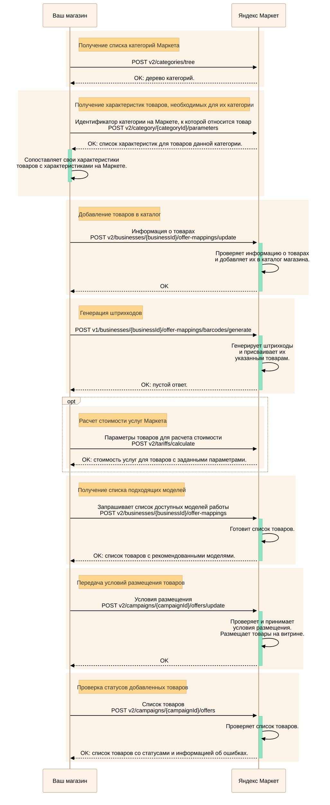
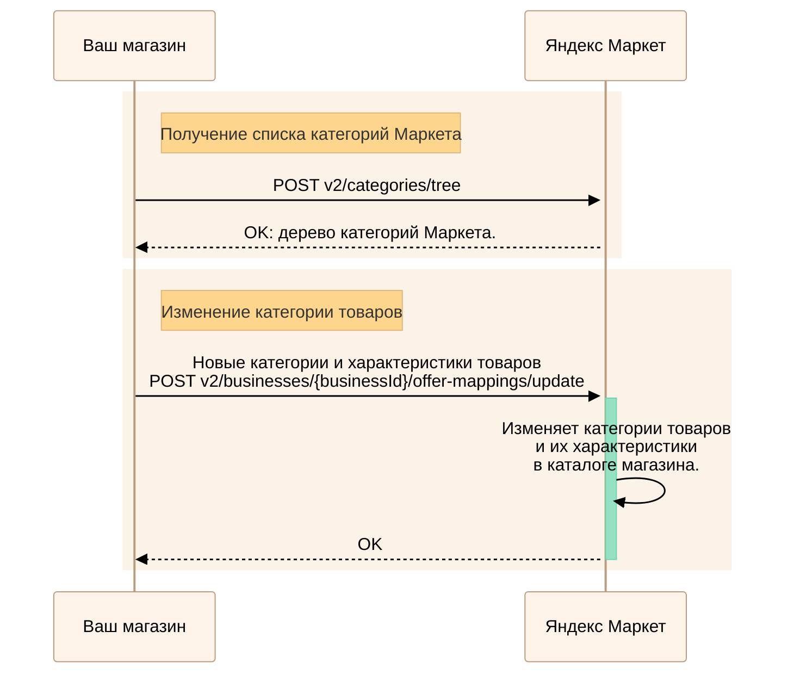

---
metadata:
  - name: generator
    content: Diplodoc Platform v5.55.3
alternate:
  - https://yandex.ru/dev/market/partner-api/doc/en/step-by-step/assortment-add-goods.md
  - https://yandex.ru/dev/market/partner-api/doc/ru/step-by-step/assortment-add-goods.md
  - https://yandex.ru/dev/market/partner-api/doc/zh/step-by-step/assortment-add-goods.md
  - href: ru/step-by-step/assortment-add-goods.md
    type: text/markdown
    title: Markdown version
  - href: ../llms.txt
    type: text/markdown
    title: llms.txt
---
> **Documentation Index:** Fetch the complete configuration index at https://yandex.ru/dev/market/partner-api/doc/ru/llms.txt

# Добавление и редактирование товаров

С помощью запроса [POST v2/businesses/{businessId}/offer-mappings/update](https://yandex.ru/dev/market/partner-api/doc/ru/reference/business-offer-mappings/updateOfferMappings.md) вы можете добавлять товары в каталог и передавать:

* их [листовые категории](*list-categories) на Маркете и категорийные характеристики;
* основные характеристики;
* цены на товары в кабинете.

А также объединять товары на карточке, редактировать и удалять информацию об уже добавленных товарах, в том числе цены в кабинете и категории товаров.

Чтобы узнать источник и время обновления информации:

  1. В кабинете продавца на Маркете перейдите на страницу **Товары** → **Каталог**.
  1. Нажмите на интересующий товар.
  1. В правом верхнем углу нажмите кнопку  и включите опцию **Источник данных**.

      Информация о передаче данных появится под соответствующими характеристиками.
      

## Добавить новые товары в каталог {#add}

Чтобы добавить товары в каталог и разместить их в магазине, нужно последовательно выполнить несколько запросов к Маркету:

<!-- source: ru/_includes/mermaid/assortment-add.md -->

<!-- endsource: ru/_includes/mermaid/assortment-add.md -->

1. Получите список категорий Маркета, выполнив запрос [POST v2/categories/tree](https://yandex.ru/dev/market/partner-api/doc/ru/reference/categories/getCategoriesTree.md).
1. Для каждой [листовой категории](*list-category) запросите список необходимых характеристик с помощью [POST v2/category/{categoryId}/parameters](https://yandex.ru/dev/market/partner-api/doc/ru/reference/content/getCategoryContentParameters.md).

    Для характеристик, у которых есть единицы измерения, в параметре `unit` вернутся:

    * допустимые значения (`units`);
    * значение по умолчанию (`defaultUnitId`).

1. Вызовите метод [POST v2/businesses/{businessId}/offer-mappings/update](https://yandex.ru/dev/market/partner-api/doc/ru/reference/business-offer-mappings/updateOfferMappings.md), где:

    * Передайте информацию о товарах (названия, описания, фотографии и так далее), цены, [листовые категории](*list-categories) на Маркете и характеристики.
    * При необходимости измените идентификатор единицы измерения характеристик — параметр `unitId` в `parameterValues`. Если его не передать, будут использованы единицы измерения по умолчанию (`defaultUnitId`).
    * Перед тем как формировать `parameterValues`, ознакомьтесь с [«Передача значений характеристики»](https://yandex.ru/dev/market/partner-api/doc/ru/step-by-step/parameter-values.md) — там описаны типовые случаи, ограничения и примеры.

    **Для продавцов Market Yandex Go:** также прочтите [инструкцию](https://yandex.ru/dev/market/partner-api/doc/ru/market-yandex-go-sellers.md).

1. Для товаров, у которых нет штрихкодов производителя, сгенерируйте штрихкоды Маркета — метод [POST v1/businesses/{businessId}/offer-mappings/barcodes/generate](https://yandex.ru/dev/market/partner-api/doc/ru/reference/business-offer-mappings/generateOfferBarcodes.md).
1. При необходимости посмотрите стоимость услуг Маркета для конкретных товаров. Для этого передайте их параметры в запросе [POST v2/tariffs/calculate](https://yandex.ru/dev/market/partner-api/doc/ru/reference/tariffs/calculateTariffs.md).
1. Получите у Маркета список моделей, по которым можно продавать каждый из добавленных товаров с помощью запроса [POST v2/businesses/{businessId}/offer-mappings](https://yandex.ru/dev/market/partner-api/doc/ru/reference/business-offer-mappings/getOfferMappings.md). [Что такое модель работы и какие модели есть](https://yandex.ru/support/marketplace/introduction/models.html)
1. Задайте условия размещения товаров с помощью запроса [POST v2/campaigns/{campaignId}/offers/update](https://yandex.ru/dev/market/partner-api/doc/ru/reference/offers/updateCampaignOffers.md). Условия размещения — это минимальный объем заказа, квант продаж и НДС. Если вы работаете по модели DBS, этим же запросом задаются параметры доставки.
1. Убедитесь, что товары появились на витрине, с помощью запроса [POST v2/campaigns/{campaignId}/offers](https://yandex.ru/dev/market/partner-api/doc/ru/reference/offers/getCampaignOffers.md). Подробные пояснения к статусам товаров вы найдете [в Справке Маркета для продавцов](https://yandex.ru/support/marketplace/assortment/add/statuses.html).



Каждый из добавленных вами товаров будет размещен на соответствующей странице — карточке. Чтобы разобраться с тем, как устроены карточки на Маркете, прочтите [статью в Справке Маркета для продавцов](https://yandex.ru/support/marketplace/assortment/content/index.html).

В запросе [POST v2/businesses/{businessId}/offer-mappings](https://yandex.ru/dev/market/partner-api/doc/ru/reference/business-offer-mappings/getOfferMappings.md) можно проверить текущую привязку товара к карточке.

При передаче идентификатора карточки в запросе [POST v2/businesses/{businessId}/offer-mappings/update](https://yandex.ru/dev/market/partner-api/doc/ru/reference/business-offer-mappings/updateOfferMappings.md) Маркет учтет ваше предложение по привязке, но по результатам проверки может привязать товар к более подходящей карточке.



## Изменить категории товаров {#change-category}

<!-- source: ru/_includes/mermaid/assortment-change-category.md -->

<!-- endsource: ru/_includes/mermaid/assortment-change-category.md -->

1. Получите список категорий Маркета с помощью запроса  [POST v2/categories/tree](https://yandex.ru/dev/market/partner-api/doc/ru/reference/categories/getCategoriesTree.md).

1. Чтобы изменить категории товаров, которые вы уже добавили в каталог, в запросе [POST v2/businesses/{businessId}/offer-mappings/update](https://yandex.ru/dev/market/partner-api/doc/ru/reference/business-offer-mappings/updateOfferMappings.md) передайте:

    * Их идентификаторы — `offerId`.
    * Идентификаторы новых [листовых категорий](*list-categories) — `marketCategoryId`.
    * Характеристики товаров и их значения для новых категорий — `parameterValues`. Значения общих характеристик для старой и новой категории сохранятся, передавать их не нужно.

## Изменить характеристики товаров {#change-parameters}

Чтобы изменить характеристики товаров, которые вы уже добавили в каталог, в запросе [POST v2/businesses/{businessId}/offer-mappings/update](https://yandex.ru/dev/market/partner-api/doc/ru/reference/business-offer-mappings/updateOfferMappings.md) повторно передайте:

* Их идентификаторы — `offerId`.
* Идентификаторы [листовых категорий](*list-categories) — `marketCategoryId`. Если не передать, в ответе придет предупреждение (параметр `warnings`).
* Новые характеристики и их значения — `parameterValues`. Если не передать `parameterValues` и `marketCategoryId`, будет использована информация из устаревших параметров `params` и `category`, а `marketCategoryId` будет определен автоматически.

При необходимости измените идентификатор единицы измерения характеристик — параметр `unitId` в `parameterValues`. Если его не передать, будут использованы единицы измерения по умолчанию (`defaultUnitId`).

Параметры, в которых ничего не меняется, можно не передавать.

Характеристики товаров по категориям можно получить с помощью запроса [POST v2/category/{categoryId}/parameters](https://yandex.ru/dev/market/partner-api/doc/ru/reference/content/getCategoryContentParameters.md).

Также категорийные характеристики можно изменить с помощью [инструкции](https://yandex.ru/dev/market/partner-api/doc/ru/step-by-step/content-change.md).

## Удалить характеристики товаров {#delete}

Чтобы удалить переданные ранее характеристики товаров, используйте запрос [POST v2/businesses/{businessId}/offer-mappings/update](https://yandex.ru/dev/market/partner-api/doc/ru/reference/business-offer-mappings/updateOfferMappings.md) — в `deleteParameters` укажите  значения параметров, которые хотите удалить.

Можно передать сразу несколько значений.

Для параметров с типом `string` также можно передать пустое значение.

## Объединить товары на карточке {#combine-variants}

Чтобы объединить варианты товаров на одной карточке:

1. Сделайте запрос [POST v2/category/{categoryId}/parameters](https://yandex.ru/dev/market/partner-api/doc/ru/reference/content/getCategoryContentParameters.md). Характеристики, которые являются особенностями варианта товара, могут зависеть от кабинета. Чтобы узнать их, передайте параметр `businessId`.

    Если категория поддерживает объединение вариантов:

    * Среди характеристик будет такая:

      |Параметр|Значение|
      |-|-|
      |id|200|
      |name|Название группы вариантов|

    * Вернутся характеристики со значением `true` в поле `distinctive`.

2. Добавьте каждый вариант в каталог по отдельности.
3. Передайте для них категорийные характеристики — параметр `parameterValues` в методе [POST v2/businesses/{businessId}/offer-mappings/update](https://yandex.ru/dev/market/partner-api/doc/ru/reference/business-offer-mappings/updateOfferMappings.md) или [POST v2/businesses/{businessId}/offer-cards/update](https://yandex.ru/dev/market/partner-api/doc/ru/reference/content/updateOfferContent.md).

    Руководствуйтесь следующими правилами:

      * Название группы вариантов должно быть **одинаковым** у всех товаров, которые нужно отображать как варианты на единой карточке.
      * Названием группы вариантов может быть последовательность любых символов длиной до 255 знаков.
      * Каждый вариант должен отличаться от всех остальных по `distinctive`-характеристикам.
      * Все остальные характеристики должны иметь одинаковые значения.

          **Пример.** В некоторой категории есть три характеристики — особенности вариантов (`distinctive`: `true`): **цвет для фильтра**, **размер** и **наличие Wi-Fi**. И еще характеристики **материал** и **серия**, не являющиеся особенностями вариантов.

          

          - ✅ Правильно

            ||Цвет для фильтра|Размер|Есть Wi-Fi|Материал|Серия|
            |-|-|-|-|-|-|
            |Вариант 1|Красный|XL|Да|Дерево|«Юпитер»|
            |Вариант 2|Красный|XL|—|Дерево|«Юпитер»|
            |Вариант 3|Зеленый|S|Да|Дерево|«Юпитер»|

            У каждого варианта свой набор `distinctive`-характеристик, а остальные совпадают.

          - ❌ Неправильно

            ||Цвет для фильтра|Размер|Есть Wi-Fi|Материал|Серия|
            |-|-|-|-|-|-|
            |Вариант 1|Красный|XL|Да|Дерево|«Юпитер»|
            |Вариант 2|Красный|XL|Да|Дерево|«Юпитер»|
            |Вариант 3|Зеленый|S|Да|Дерево|«Юпитер»|

            У варианта 1 и варианта 2 совпадают особенности.

            

            ||Цвет для фильтра|Размер|Есть Wi-Fi|Материал|Серия|
            |-|-|-|-|-|-|
            |Вариант 1|Красный|XL|Да|Дерево|«Юпитер»|
            |Вариант 2|Красный|XL|—|Дерево|«Юпитер»|
            |Вариант 3|Зеленый|S|Да|Сталь|«Марс»|

            У вариант 3 отличается характеристиками, не являющимися особенностями варианта.

          

У товаров, которые объединены в одну группу, будет одинаковый идентификатор `groupId`.

Подробно о том, как работать с вариантами товара, рассказано в [Справке Маркета для продавцов](https://yandex.ru/support/marketplace/assortment/content/combine.html).



* [Изменение категорийных характеристик](https://yandex.ru/dev/market/partner-api/doc/ru/step-by-step/content-change.md)
* [Рекомендации Маркета по карточкам](https://yandex.ru/dev/market/partner-api/doc/ru/step-by-step/recommendations.md)
* [Управление товарами в архиве](https://yandex.ru/dev/market/partner-api/doc/ru/step-by-step/assortment-archive.md)



## Удаление товаров из каталога {#deletion}

Удалите товары из каталога с помощью API:

 - [POST v2/businesses/{businessId}/offer-mappings/delete](https://yandex.ru/dev/market/partner-api/doc/ru/reference/business-offer-mappings/deleteOffers.md) — удаляет указанные товары из каталога кабинета
 - [POST v2/campaigns/{campaignId}/offers/delete](https://yandex.ru/dev/market/partner-api/doc/ru/reference/offers/deleteCampaignOffers.md) — удаляет указанные товары из ассортимента выбранного магазина, не влияет на другие магазины и на наличие товара в общем каталоге



Учтите: товар повторно вернется в каталог, если:

- вы передаете товар через API
- вы используете внешнее решение интегратора, которое синхронизирует товар с Маркетом
- вы передаете товары через YML-файл и запускается синхронизация
- вы загружаете товар вручную через Excel
- у вас включена синхронизация данных с внешними площадками Ozon/WB в личном кабинете продавца



[*list-category]:
Категория, у которой нет дочерних.

[*list-categories]:
Категории, у которых нет дочерних.
