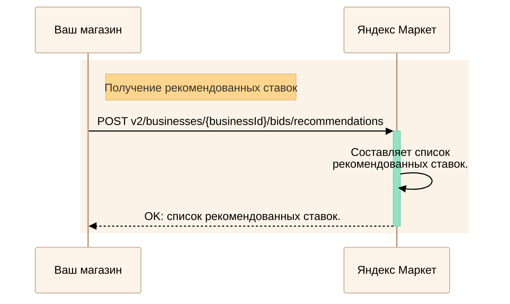
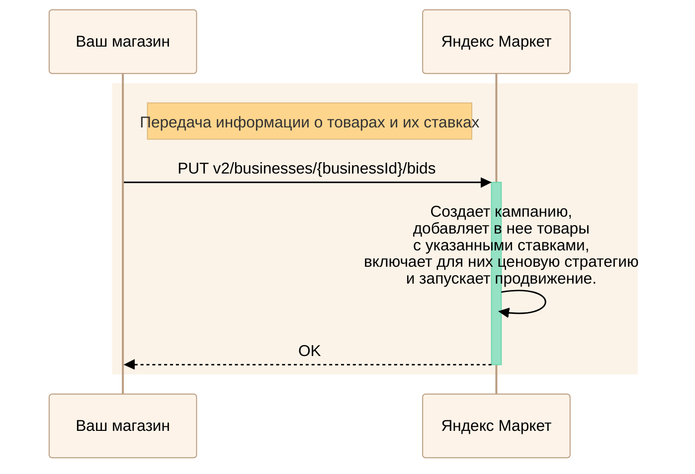
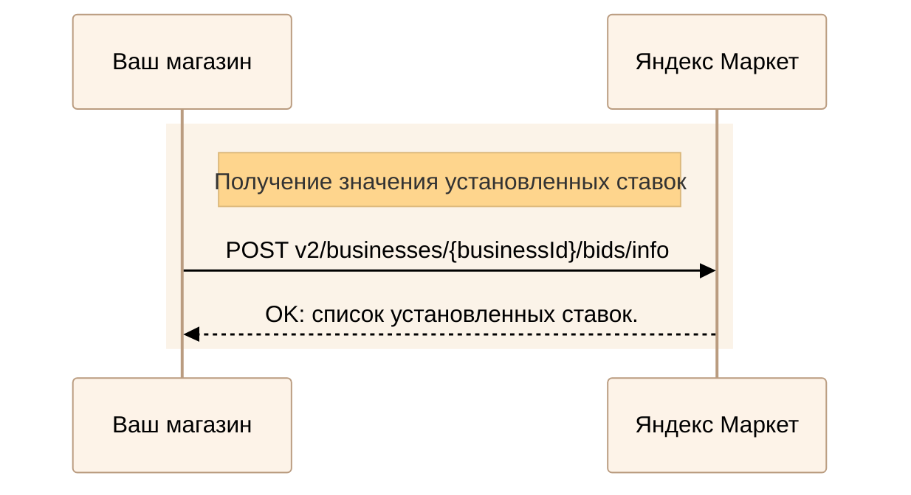
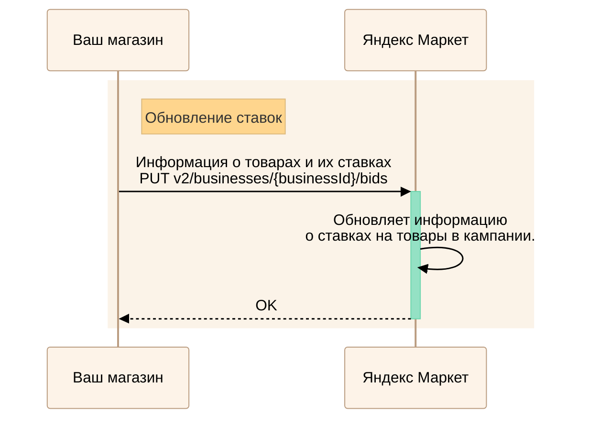
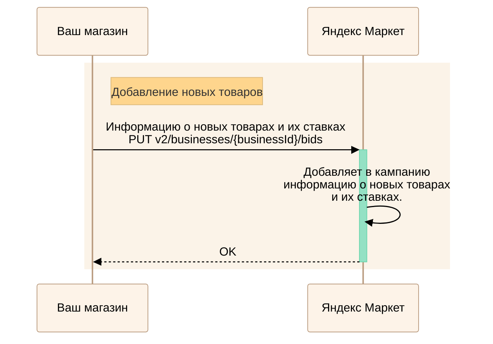
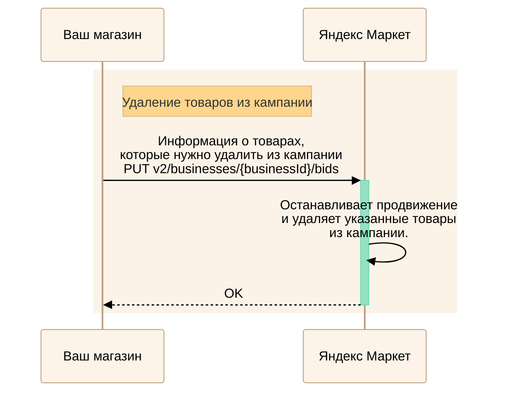

---
metadata:
  - name: generator
    content: Diplodoc Platform v5.61.0
alternate:
  - https://yandex.ru/dev/market/partner-api/doc/en/step-by-step/boost.md
  - https://yandex.ru/dev/market/partner-api/doc/ru/step-by-step/boost.md
  - https://yandex.ru/dev/market/partner-api/doc/zh/step-by-step/boost.md
  - href: https://yandex.ru/dev/market/partner-api/doc/ru/step-by-step/boost.md
    type: text/markdown
    title: Markdown version
  - href: https://yandex.ru/dev/market/partner-api/doc/ru/llms.txt
    rel: describedby
---
> **Documentation Index:** Fetch the complete configuration index at https://yandex.ru/dev/market/partner-api/doc/ru/llms.txt

# Работа с бустом продаж

Через API можно запускать буст продаж — создать и включить единую на все магазины бизнес-аккаунта кампанию, добавить в нее товары и назначить на них ставки. Управлять такой кампанией —  добавлять, обновлять, удалять и получать ставки на товары — можно только через API.

Внести другие изменения в созданную через API кампанию можно в кабинете:

* Выключить или включить кампанию.
* Изменить ее название.
* Выключить или включить ценовую стратегию. Подробнее о ценовой стратегии читайте в [Справке Маркета для продавцов](https://yandex.ru/support/marketplace/marketing/campaigns.html#price-strategy).

Кампаниями, которые вы создали в кабинете, управлять через API не получится.

## Как получить рекомендованные ставки {#recommendations}

Чтобы узнать значения рекомендованных ставок, выполните запрос [POST v2/businesses/{businessId}/bids/recommendations](https://yandex.ru/dev/market/partner-api/doc/ru/reference/bids/getBidsRecommendations.md).

<!-- source: ru/_includes/mermaid/boost-recommendations.md -->

<!-- endsource: ru/_includes/mermaid/boost-recommendations.md -->

## Как создать кампанию {#new-boost}

Передайте информацию о товарах (SKU) и их ставках с помощью запроса [PUT v2/businesses/{businessId}/bids](https://yandex.ru/dev/market/partner-api/doc/ru/reference/bids/putBidsForBusiness.md). Новая кампания создается при первом использовании запроса или при повторном, если в кабинете вы удалили ранее созданную через API кампанию.

<!-- source: ru/_includes/mermaid/boost-new.md -->

<!-- endsource: ru/_includes/mermaid/boost-new.md -->

## Как получить установленные ставки {#get-bids}

Чтобы узнать значения установленных через API ставок, выполните запрос [POST v2/businesses/{businessId}/bids/info](https://yandex.ru/dev/market/partner-api/doc/ru/reference/bids/getBidsInfoForBusiness.md).



В ответе возвращаются значения только тех ставок, которые вы установили через запрос [PUT v2/businesses/{businessId}/bids](https://yandex.ru/dev/market/partner-api/doc/ru/reference/bids/putBidsForBusiness.md).



<!-- source: ru/_includes/mermaid/boost-get.md -->

<!-- endsource: ru/_includes/mermaid/boost-get.md -->

## Как изменить данные в кампании {#change-boost}

Обновить ставки, добавить или удалить товары из созданной через API кампании можно с помощью запроса [PUT v2/businesses/{businessId}/bids](https://yandex.ru/dev/market/partner-api/doc/ru/reference/bids/putBidsForBusiness.md). В одном запросе вы можете выполнить несколько действий — например, добавить в кампанию новые товары и удалить старые.

### Обновить ставки {#change-bids}

Чтобы обновить ставки на товары в созданной кампании, выполните запрос [PUT v2/businesses/{businessId}/bids](https://yandex.ru/dev/market/partner-api/doc/ru/reference/bids/putBidsForBusiness.md), где передайте новые значения ставок.

<!-- source: ru/_includes/mermaid/boost-change.md -->

<!-- endsource: ru/_includes/mermaid/boost-change.md -->

### Добавить в кампанию новые товары {#add-goods}

Чтобы добавить в кампанию новые товары, выполните запрос [PUT v2/businesses/{businessId}/bids](https://yandex.ru/dev/market/partner-api/doc/ru/reference/bids/putBidsForBusiness.md), где передайте информацию о новых товарах (SKU) и их ставках.

<!-- source: ru/_includes/mermaid/boost-add.md -->

<!-- endsource: ru/_includes/mermaid/boost-add.md -->

### Удалить товары из кампании {#delete-goods}

Чтобы остановить продвижение отдельных товаров, выполните запрос [PUT v2/businesses/{businessId}/bids](https://yandex.ru/dev/market/partner-api/doc/ru/reference/bids/putBidsForBusiness.md), где передайте нулевую ставку в поле `bid` для тех товаров, которые нужно удалить из кампании.

<!-- source: ru/_includes/mermaid/boost-delete.md -->

<!-- endsource: ru/_includes/mermaid/boost-delete.md -->

## Как получить отчет по бусту продаж {#get-report}

О том, как получать отчеты, читайте в [пошаговой инструкции](https://yandex.ru/dev/market/partner-api/doc/ru/step-by-step/reports.md).
