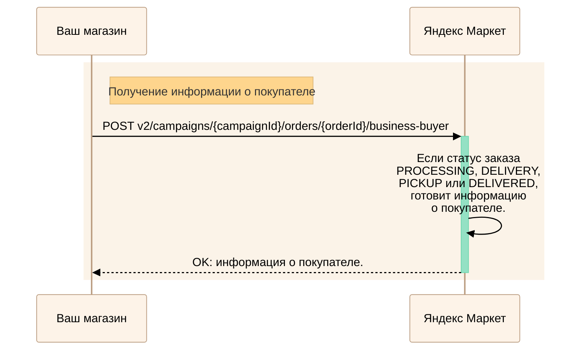
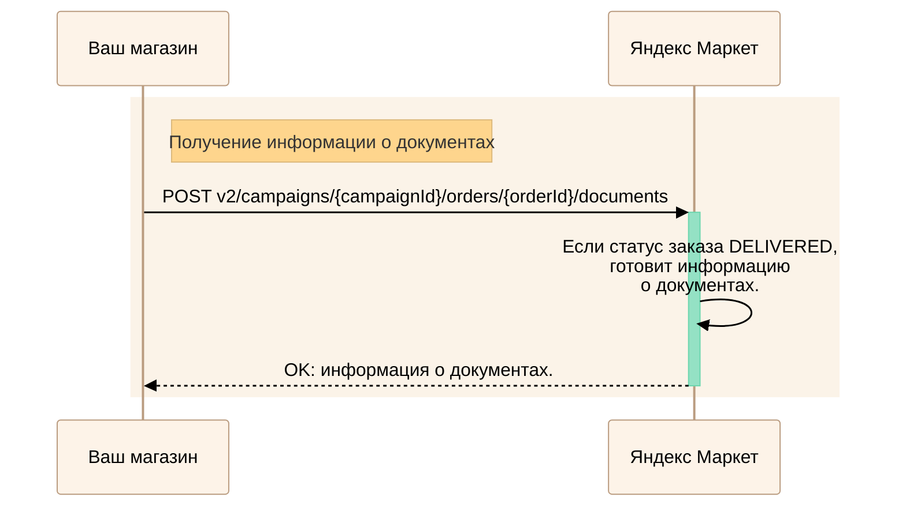

---
metadata:
  - name: generator
    content: Diplodoc Platform v5.57.3
alternate:
  - https://yandex.ru/dev/market/partner-api/doc/en/step-by-step/business-info.md
  - https://yandex.ru/dev/market/partner-api/doc/ru/step-by-step/business-info.md
  - https://yandex.ru/dev/market/partner-api/doc/zh/step-by-step/business-info.md
  - href: ru/step-by-step/business-info.md
    type: text/markdown
    title: Markdown version
  - href: ../llms.txt
    type: text/markdown
    title: llms.txt
---
> **Documentation Index:** Fetch the complete configuration index at https://yandex.ru/dev/market/partner-api/doc/ru/llms.txt

# Обработка заказов от юридических лиц

Особенности работы с такими заказами — в запросах [PUT v2/campaigns/{campaignId}/orders/{orderId}/identifiers](https://yandex.ru/dev/market/partner-api/doc/ru/reference/orders/provideOrderItemIdentifiers.md) или [PUT v2/campaigns/{campaignId}/orders/{orderId}/boxes](https://yandex.ru/dev/market/partner-api/doc/ru/reference/orders/setOrderBoxLayout.md):

* Передавайте коды маркировки в системе в «[Честный знак](*cz)», если такая маркировка предусмотрена для товара.

* При продаже товаров **из-за рубежа** указывайте:

    * Регистрационный номер партии товара — `rnpt`.
    * Номер грузовой таможенной декларации — `gtd`.
    * Код страны производства — `countryCode`. [Как получить](https://yandex.ru/dev/market/partner-api/doc/ru/reference/regions/getRegionsCodes.md)

Через API вы также можете получить информацию о покупателе, который является юридическим лицом, и о документах по его заказу:

* УПД;
* УКД;
* товарной накладной;
* счете-фактуре;
* корректировочном счете-фактуре.

## Как определить, что заказ от юридического лица {#business-buyer}

Вызовите метод [POST v1/businesses/{businessId}/orders](https://yandex.ru/dev/market/partner-api/doc/ru/reference/orders/getBusinessOrders.md).

Признаки заказа от юридического лица:

* в `order` вернется вложенный параметр `buyer` и поле `type` с типом плательщика `BUSINESS`;
* параметр `paymentMethod` вернется со значением `B2B_ACCOUNT_PREPAYMENT` (организация оплатила заказ) или `B2B_ACCOUNT_POSTPAYMENT` (организация оплатит заказ после доставки).

Обратите внимание, что параметры `shipmentDate` и `shipmentTime` не возвращаются, пока с покупателем не будет согласована дата доставки.

## Как получить информацию о покупателе {#buyer-info}

<!-- source: ru/_includes/mermaid/business-buyer-info.md -->

<!-- endsource: ru/_includes/mermaid/business-buyer-info.md -->

Получить данные можно, только если заказ находится в статусе `PROCESSING`, `DELIVERY`, `PICKUP` или `DELIVERED`.

Чтобы узнать информацию о покупателе, выполните запрос [POST v2/campaigns/{campaignId}/orders/{orderId}/business-buyer](https://yandex.ru/dev/market/partner-api/doc/ru/reference/order-business-information/getOrderBusinessBuyerInfo.md).

## Как получить информацию о документах {#documents-info}

<!-- source: ru/_includes/mermaid/business-documents-info.md -->

<!-- endsource: ru/_includes/mermaid/business-documents-info.md -->

Получить данные можно после того, как заказ перейдет в статус `DELIVERED`.

Чтобы запросить информацию о документах, выполните запрос [POST v2/campaigns/{campaignId}/orders/{orderId}/documents](https://yandex.ru/dev/market/partner-api/doc/ru/reference/order-business-information/getOrderBusinessDocumentsInfo.md).

[*cz]: «Честный знак» — государственная система маркировки и отслеживания товаров. [Узнать больше](https://yandex.ru/support/marketplace/orders/cz.html)
