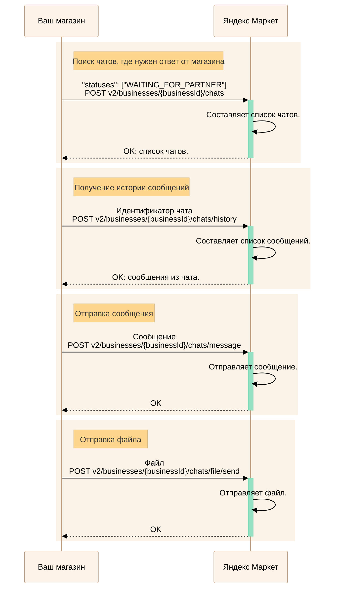
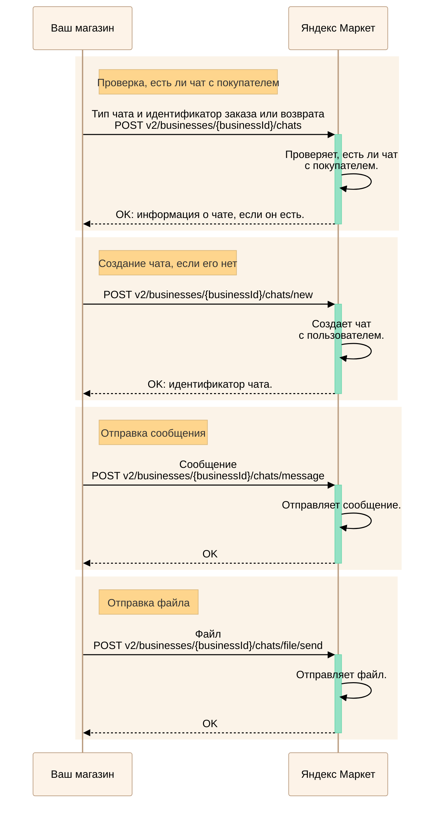

---
metadata:
  - name: generator
    content: Diplodoc Platform v5.57.3
alternate:
  - https://yandex.ru/dev/market/partner-api/doc/en/step-by-step/chats.md
  - https://yandex.ru/dev/market/partner-api/doc/ru/step-by-step/chats.md
  - https://yandex.ru/dev/market/partner-api/doc/zh/step-by-step/chats.md
  - href: ru/step-by-step/chats.md
    type: text/markdown
    title: Markdown version
  - href: ../llms.txt
    type: text/markdown
    title: llms.txt
---
> **Documentation Index:** Fetch the complete configuration index at https://yandex.ru/dev/market/partner-api/doc/ru/llms.txt

# Чаты с покупателями

API Маркета позволяет общаться с вашими покупателями в чатах.

Какие бывают чаты:

* `ORDER` — по заказам. [Чаты о заказах и возвратах](https://yandex.ru/support/marketplace/ru/orders/communication/about-orders)
* `RETURN` — по возвратам (FBY, FBS и Экспресс). [Чаты о заказах и возвратах](https://yandex.ru/support/marketplace/ru/orders/communication/about-orders)
* `DIRECT` — чат, который начинает покупатель, если у него есть вопросы по товару. Продавец не может создать его. [Подробнее о таких чатах](https://yandex.ru/support/marketplace/ru/orders/communication/with-users)

## Как проверить, есть ли новые чаты или сообщения {#check}

**Через API-уведомления:**

  Маркет отправит вам запрос [POST notification](https://yandex.ru/dev/market/partner-api/doc/ru/push-notifications/reference/sendNotification.md), когда появится новый чат или сообщение:

  * На **CHAT_CREATED**: Создайте чат в своей системе и сохраните `chatId`. Один раз получите контекст чата методом [GET v2/businesses/{businessId}/chat](https://yandex.ru/dev/market/partner-api/doc/ru/reference/chats/getChat.md) и сохраните информацию о чате.

  * На **CHAT_MESSAGE_SENT**: Получайте только сообщение методом [GET v2/businesses/{businessId}/chats/message](https://yandex.ru/dev/market/partner-api/doc/ru/reference/chats/getChatMessage.md). Если чат еще не сохранен, получите его один раз методом [GET v2/businesses/{businessId}/chat](https://yandex.ru/dev/market/partner-api/doc/ru/reference/chats/getChat.md) и сохраните.

**Через основное API:**

  * Проверьте, есть ли чат с покупателем — [POST v2/businesses/{businessId}/chats](https://yandex.ru/dev/market/partner-api/doc/ru/reference/chats/getChats.md). В запросе передайте тип чата и идентификатор заказа или возврата, к которому он относится.

  * Для получения одного конкретного чата — [GET v2/businesses/{businessId}/chat](https://yandex.ru/dev/market/partner-api/doc/ru/reference/chats/getChat.md)

Чтобы получить сообщения, используйте методы:

* [POST v2/businesses/{businessId}/chats/history](https://yandex.ru/dev/market/partner-api/doc/ru/reference/chats/getChatHistory.md) — для истории сообщений по чату;
* [GET v2/businesses/{businessId}/chats/message](https://yandex.ru/dev/market/partner-api/doc/ru/reference/chats/getChatMessage.md) — для сообщения.

## Как ответить на сообщение {#answer}

<!-- source: ru/_includes/mermaid/chats-answer.md -->

<!-- endsource: ru/_includes/mermaid/chats-answer.md -->

1. Найдите чаты, где нужен ваш ответ. Для этого выполните запрос [POST v2/businesses/{businessId}/chats](https://yandex.ru/dev/market/partner-api/doc/ru/reference/chats/getChats.md).
   В запросе передайте статус «Нужен ответ магазина» ("statuses": ["WAITING_FOR_PARTNER"]).

1. Чтобы получить историю сообщений в чате, используйте запрос [POST v2/businesses/{businessId}/chats/history](https://yandex.ru/dev/market/partner-api/doc/ru/reference/chats/getChatHistory.md), где передайте идентификатор чата.

1. Отправьте сообщение с помощью запроса [POST v2/businesses/{businessId}/chats/message](https://yandex.ru/dev/market/partner-api/doc/ru/reference/chats/sendMessageToChat.md).
   Если вам нужно отправить покупателю файл — например, дополнительную фотографию товара — используйте запрос [POST v2/businesses/{businessId}/chats/file/send](https://yandex.ru/dev/market/partner-api/doc/ru/reference/chats/sendFileToChat.md).

## Как начать чат {#create}

<!-- source: ru/_includes/mermaid/chats-create.md -->

<!-- endsource: ru/_includes/mermaid/chats-create.md -->

1. Начать новый чат и получить его идентификатор можно с помощью запроса [POST v2/businesses/{businessId}/chats/new](https://yandex.ru/dev/market/partner-api/doc/ru/reference/chats/createChat.md).
Если чат с переданным контекстом уже существует, то вернется идентификатор этого чата.

    

    В интерфейсе отладки создайте тестовый заказ, а затем нажмите **Создать тестовый чат** или выполните запрос [POST v2/businesses/{businessId}/chats/new](https://yandex.ru/dev/market/partner-api/doc/ru/reference/chats/createChat.md).

    [Подробнее о работе с тестовыми заказами](https://yandex.ru/dev/market/partner-api/doc/ru/concepts/sandbox.md)

    Обратите внимание:

    * такой чат можно создать только для заказа, не возврата;

    * в тестовых чатах нет ответов покупателей.

    

2. Отправьте сообщение запросом [POST v2/businesses/{businessId}/chats/message](https://yandex.ru/dev/market/partner-api/doc/ru/reference/chats/sendMessageToChat.md).
Если вам нужно отправить покупателю файл — например, дополнительную фотографию товара — используйте запрос [POST v2/businesses/{businessId}/chats/file/send](https://yandex.ru/dev/market/partner-api/doc/ru/reference/chats/sendFileToChat.md).

3. Проверяйте новые сообщения от покупателя — [POST v2/businesses/{businessId}/chats/history](https://yandex.ru/dev/market/partner-api/doc/ru/reference/chats/getChatHistory.md). Используйте в запросе фильтр по идентификатору последнего сообщения, чтобы получать только новые сообщения и не загружать повторно те, что у вас уже есть.
