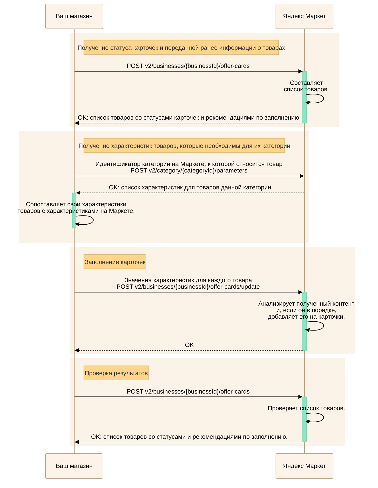
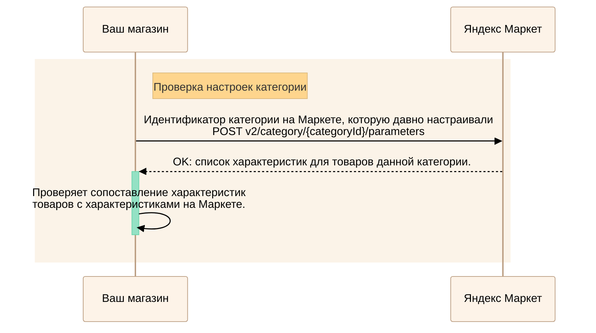

---
metadata:
  - name: generator
    content: Diplodoc Platform v5.57.3
alternate:
  - https://yandex.ru/dev/market/partner-api/doc/en/step-by-step/content-change.md
  - https://yandex.ru/dev/market/partner-api/doc/ru/step-by-step/content-change.md
  - https://yandex.ru/dev/market/partner-api/doc/zh/step-by-step/content-change.md
  - href: https://yandex.ru/dev/market/partner-api/doc/ru/step-by-step/content-change.md
    type: text/markdown
    title: Markdown version
  - href: https://yandex.ru/dev/market/partner-api/doc/ru/llms.txt
    type: text/markdown
    title: llms.txt
---
> **Documentation Index:** Fetch the complete configuration index at https://yandex.ru/dev/market/partner-api/doc/ru/llms.txt

# Изменение категорийных характеристик

Через API можно управлять контентом на карточках товаров — в том числе передавать характеристики, специфические для конкретной категории товаров.

## Товары относятся к новой для магазина категории {#edit-card}

<!-- source: ru/_includes/mermaid/content-new-category.md -->

<!-- endsource: ru/_includes/mermaid/content-new-category.md -->

1. Получите информацию, которую вы ранее передавали для карточек товаров, а также статусы карточек и рекомендации по их заполнению с помощью [POST v2/businesses/{businessId}/offer-cards](https://yandex.ru/dev/market/partner-api/doc/ru/reference/content/getOfferCardsContentStatus.md).

      В ответ вы получите следующее:
      * К каким категориям на Маркете отнесены товары. Маркет определяет категорию товара автоматически на основании предоставленных вами данных.
      * В каком статусе находятся карточки товаров.
      * Переданные характеристики товаров.
      * Рекомендации по заполнению карточек. [Как пользоваться рекомендациями](#recommendations)

2. Для каждой [листовой категории](*list-category) запросите список необходимых характеристик с помощью [POST v2/category/{categoryId}/parameters](https://yandex.ru/dev/market/partner-api/doc/ru/reference/content/getCategoryContentParameters.md).

      Для характеристик, у которых есть единицы измерения, в параметре `unit` вернутся:

      * допустимые значения (`units`);
      * значение по умолчанию (`defaultUnitId`).

3. Сопоставьте характеристики, ожидаемые Маркетом, с характеристиками, которые есть в базе данных магазина.

      **Пример.** Для суповых тарелок Маркет среди прочих ожидает характеристику «Цвет для фильтра». В базе данных магазина та же характеристика называется «Окрас». Вам нужно настроить интеграцию так, чтобы:

      * значение характеристики «Окрас» передавалось Маркету как характеристика «Цвет для фильтра»;
      * каждому значению характеристики «Окрас» было сопоставлено допустимое значение характеристики «Цвет для фильтра».

4. Передайте характеристики товаров с помощью [POST v2/businesses/{businessId}/offer-cards/update](https://yandex.ru/dev/market/partner-api/doc/ru/reference/content/updateOfferContent.md).

      

      Передача пустых значений сотрет то, что было внесено на карточки ранее.

      

      При необходимости измените идентификатор единицы измерения характеристик — параметр `unitId` в `parameterValues`. Если его не передать, будут использованы единицы измерения по умолчанию (`defaultUnitId`).

      Перед тем как формировать `parameterValues`, ознакомьтесь с [«Передача значений характеристики»](https://yandex.ru/dev/market/partner-api/doc/ru/step-by-step/parameter-values.md) — там описаны типовые случаи, ограничения и примеры.

## Товары относятся к известной и настроенной категории {#known-category}

Действуйте по инструкции для новой категории, но пропустите шаг настройки сопоставления характеристик Маркета и магазина.

## Как проверить и обновить сопоставление характеристик на Маркете и в магазине {#check-and-update-comparison}

Списки характеристик, требуемых для товаров различных категорий, не остаются неизменными. У гаджетов появляются дополнительные функции, в моду входят новые материалы. Иногда Маркет просто делает более подробным перечень характеристик на карточке товара — чтобы покупателям было удобнее сравнивать и выбирать.

Для каждой из настроенных категорий регулярно проверяйте, не нужно ли обновить сопоставление.

<!-- source: ru/_includes/mermaid/content-parameters.md -->

<!-- endsource: ru/_includes/mermaid/content-parameters.md -->



* [Добавление и редактирование товаров](https://yandex.ru/dev/market/partner-api/doc/ru/step-by-step/assortment-add-goods.md)
* [Рекомендации Маркета по карточкам](https://yandex.ru/dev/market/partner-api/doc/ru/step-by-step/recommendations.md)
* [Управление товарами в архиве](https://yandex.ru/dev/market/partner-api/doc/ru/step-by-step/assortment-archive.md)



[*list-category]:
Категория, у которой нет дочерних.
