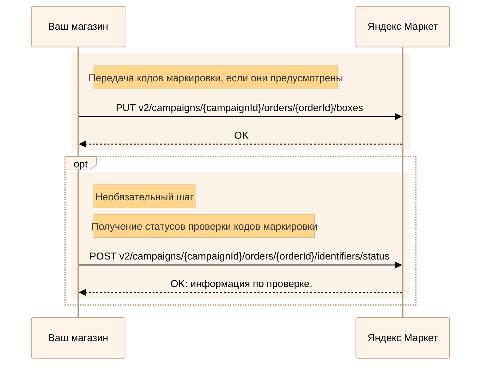
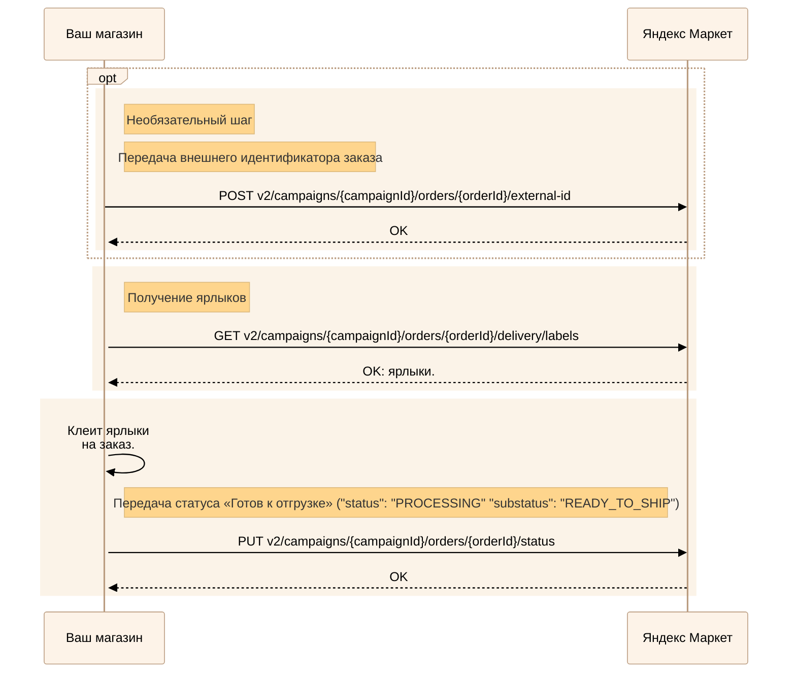
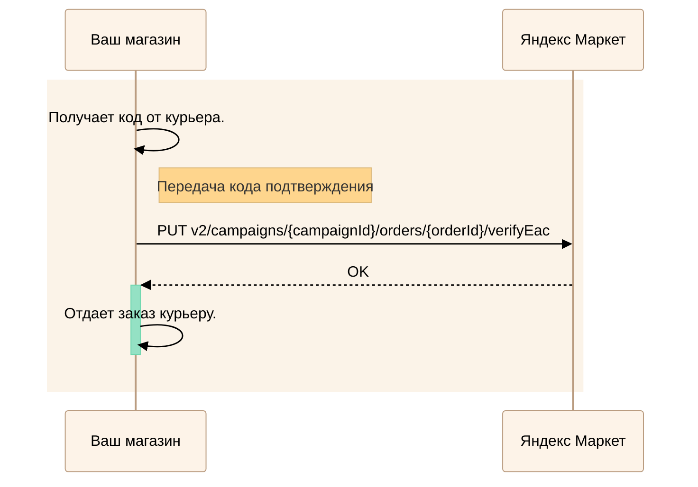
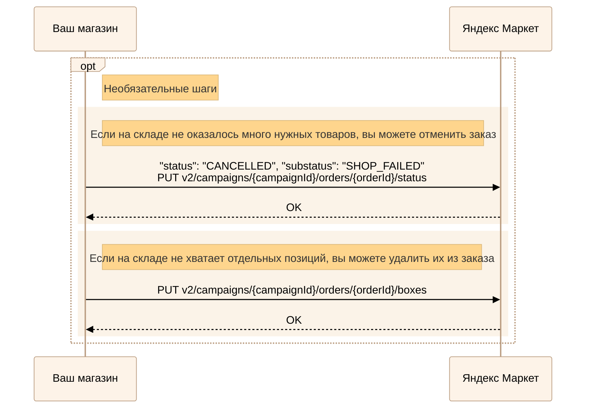

---
metadata:
  - name: generator
    content: Diplodoc Platform v5.61.1
alternate:
  - https://yandex.ru/dev/market/partner-api/doc/en/step-by-step/express.md
  - https://yandex.ru/dev/market/partner-api/doc/ru/step-by-step/express.md
  - https://yandex.ru/dev/market/partner-api/doc/zh/step-by-step/express.md
  - href: https://yandex.ru/dev/market/partner-api/doc/ru/step-by-step/express.md
    type: text/markdown
    title: Markdown version
  - href: https://yandex.ru/dev/market/partner-api/doc/ru/llms.txt
    rel: describedby
---
> **Documentation Index:** Fetch the complete configuration index at https://yandex.ru/dev/market/partner-api/doc/ru/llms.txt

# Обработка Экспресс-заказов

API Маркета позволяет выполнять все те же действия, что выполняются в кабинете: смотреть новые заказы, получать для них ярлыки, что-то менять в них при необходимости и так далее.



Прочтите [статью о выполнении заказов](https://yandex.ru/support/marketplace/ru/orders/express/process).



## Шаг 1. Получение информации по заказам {#new-orders}

Читайте инструкцию: [Получение заказов](https://yandex.ru/dev/market/partner-api/doc/ru/step-by-step/orders-receive.md)

## Шаг 2. Передача кодов маркировки {#marking-codes}



 



<!-- source: ru/_includes/mermaid/express-marking-code.md -->

<!-- endsource: ru/_includes/mermaid/express-marking-code.md -->

Если для товара предусмотрена маркировка в «Честном знаке» или других системах маркировки, передайте Маркету код каждого проданного экземпляра.

Эти сведения передаются запросом [PUT v2/campaigns/{campaignId}/orders/{orderId}/boxes](https://yandex.ru/dev/market/partner-api/doc/ru/reference/orders/setOrderBoxLayout.md).

Если в заказе есть ювелирные изделия или товары с маркировкой в системе «Честный ЗНАК», после передачи кодов Маркет начнет их проверку. [Как получить статусы проверки](https://yandex.ru/dev/market/partner-api/doc/ru/reference/orders/getOrderIdentifiersStatus.md)

## Шаг 3. Печать ярлыков и передача статуса «Готов к отгрузке» {#label}

<!-- source: ru/_includes/mermaid/express-label.md -->

<!-- endsource: ru/_includes/mermaid/express-label.md -->

1. Упакуйте собранный заказ согласно правилам, подробно описанным в [Справке Маркета для продавцов](https://yandex.ru/support/marketplace/ru/orders/express/packaging/rules).

1. Пока заказ находится в статусе `PROCESSING` с подстатусом `STARTED`, вы можете передать его внешний идентификатор — [POST v2/campaigns/{campaignId}/orders/{orderId}/external-id](https://yandex.ru/dev/market/partner-api/doc/ru/reference/orders/updateExternalOrderId.md).

1. Получите ярлыки с помощью запроса [GET v2/campaigns/{campaignId}/orders/{orderId}/delivery/labels](https://yandex.ru/dev/market/partner-api/doc/ru/reference/order-labels/generateOrderLabels.md) и наклейте их на упакованный заказ.

1. Переведите заказ в статус **Готов к отгрузке** (`"status": "PROCESSING" "substatus": "READY_TO_SHIP"`) — запрос [PUT v2/campaigns/{campaignId}/orders/{orderId}/status](https://yandex.ru/dev/market/partner-api/doc/ru/reference/orders/updateOrderStatus.md).

## Шаг 4. Передача кода подтверждения и заказа курьеру {#verifyOrderEac}

<!-- source: ru/_includes/mermaid/express-verifyOrderEac.md -->

<!-- endsource: ru/_includes/mermaid/express-verifyOrderEac.md -->

1. Передайте код подтверждения, который вам назвал курьер, в запросе [PUT v2/campaigns/{campaignId}/orders/{orderId}/verifyEac](https://yandex.ru/dev/market/partner-api/doc/ru/reference/order-delivery/verifyOrderEac.md).

1. Если проверка кода выполнена успешно, передайте заказ курьеру.

## Если товара не хватает: отмена и сокращение заказа {#cancel-by-seller}

Если во время подготовки заказа вы обнаружили, что одного или нескольких товаров нет, отмените его целиком или частично. Это делается отдельными запросами.

<!-- source: ru/_includes/mermaid/express-cancel.md -->

<!-- endsource: ru/_includes/mermaid/express-cancel.md -->

#|
||**Действие с заказом**| **Запрос**||
||Полная отмена заказа|[PUT v2/campaigns/{campaignId}/orders/{orderId}/status](https://yandex.ru/dev/market/partner-api/doc/ru/reference/orders/updateOrderStatus.md).

Переведите заказ в `"status":"CANCELLED"` `"substatus": "SHOP_FAILED"`.||
||Исключение товара из заказа|[PUT v2/campaigns/{campaignId}/orders/{orderId}/boxes](https://yandex.ru/dev/market/partner-api/doc/ru/reference/orders/setOrderBoxLayout.md)||
|#



Любое из этих действий понизит [индекс качества](*quality-index) магазина. Когда индекс качества снижается, магазин сталкивается с ограничениями.



[*quality-index]: Индекс качества — число от 0 до 100. Если магазин работает по модели FBY, индекс качества показывает, насколько хорошо продавец делает поставки на склады Маркета, а в моделях FBS, DBS и Экспресс индекс оценивает работу с заказами. [Узнать больше](https://yandex.ru/support/marketplace/quality/score/index.html)
