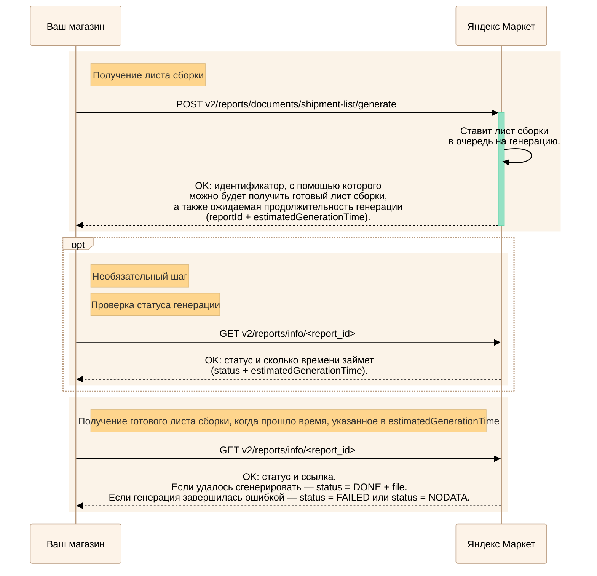
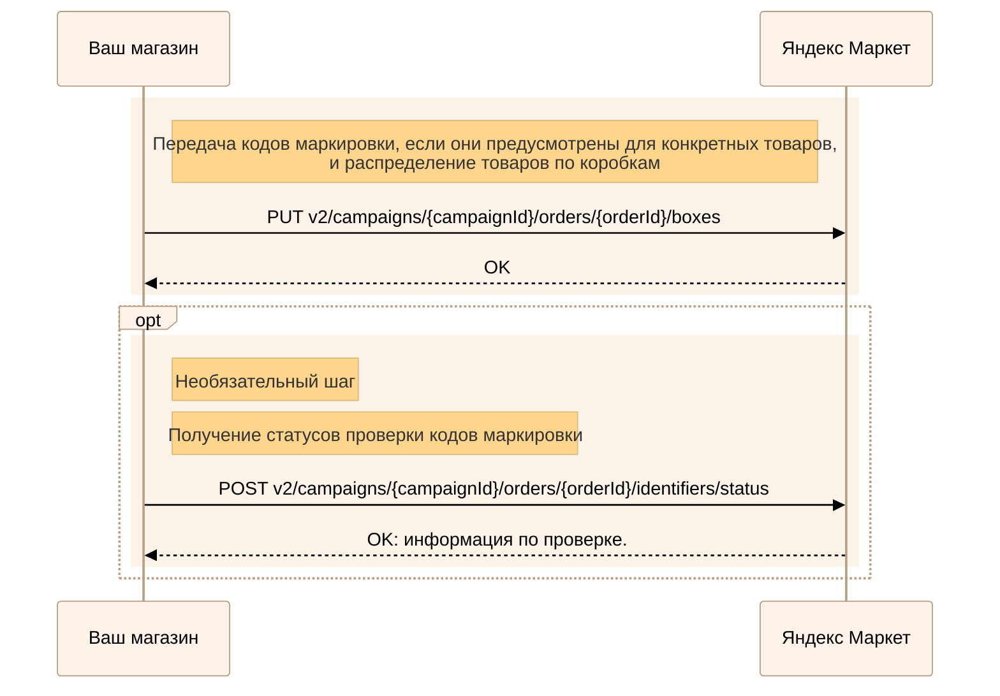
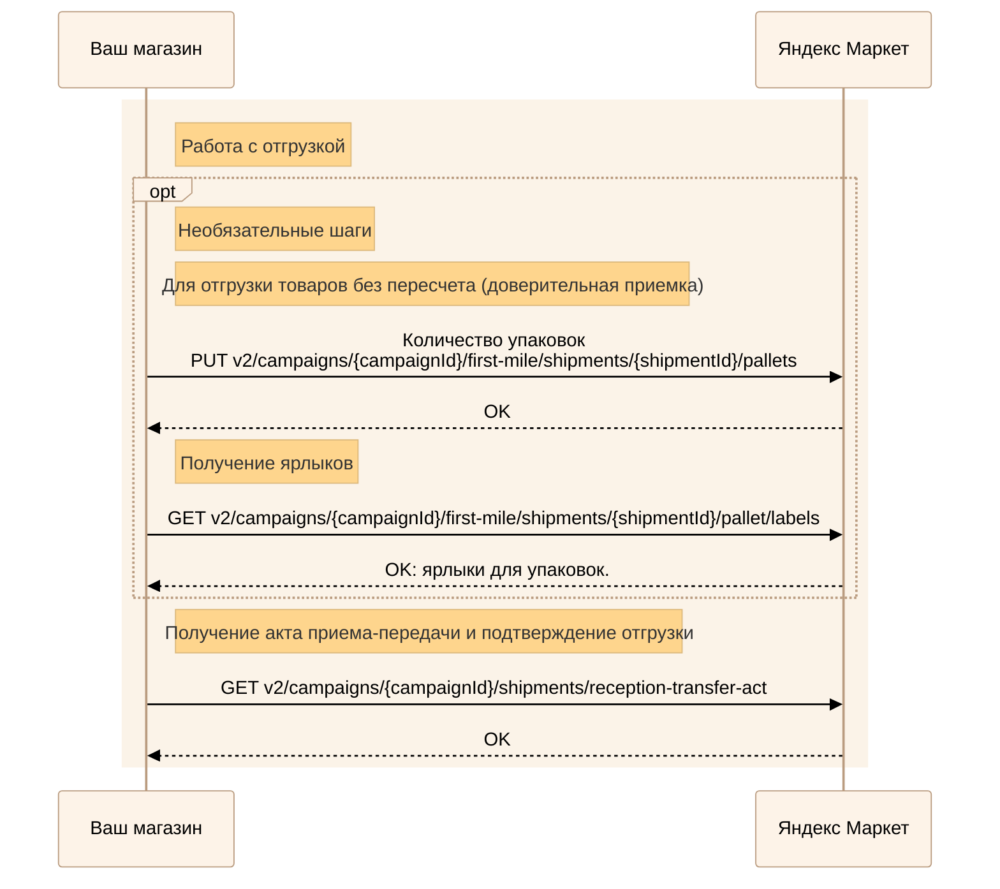
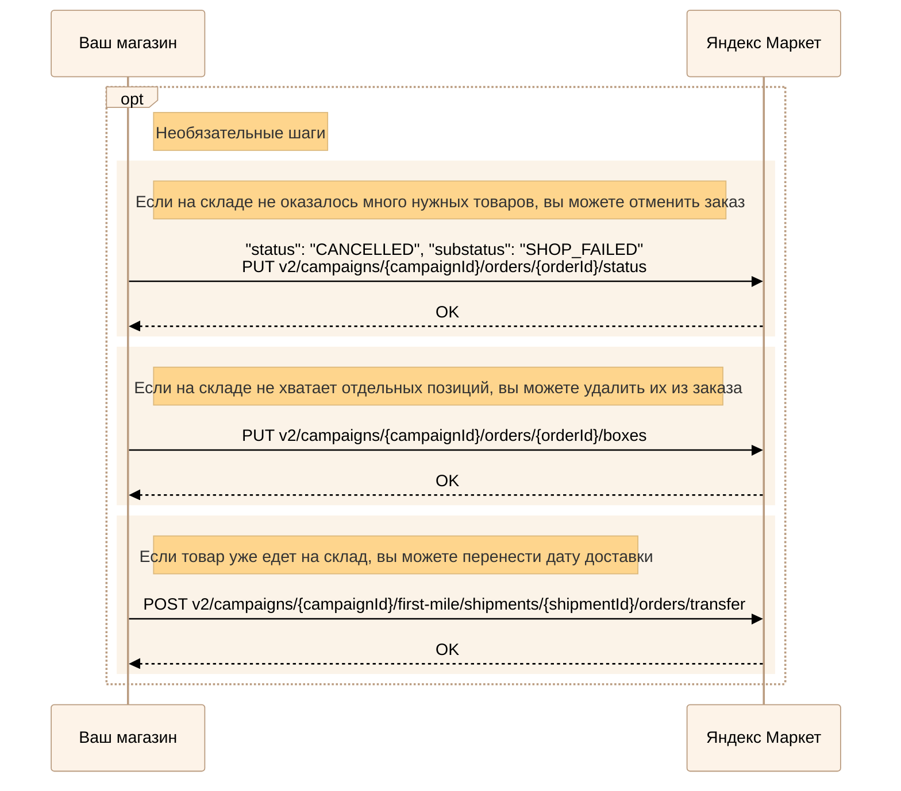

---
metadata:
  - name: generator
    content: Diplodoc Platform v5.55.3
alternate:
  - https://yandex.ru/dev/market/partner-api/doc/en/step-by-step/fbs.md
  - https://yandex.ru/dev/market/partner-api/doc/ru/step-by-step/fbs.md
  - https://yandex.ru/dev/market/partner-api/doc/zh/step-by-step/fbs.md
  - href: ru/step-by-step/fbs.md
    type: text/markdown
    title: Markdown version
  - href: ../llms.txt
    type: text/markdown
    title: llms.txt
---
> **Documentation Index:** Fetch the complete configuration index at https://yandex.ru/dev/market/partner-api/doc/ru/llms.txt

# Обработка FBS-заказов

API Маркета позволяет выполнять все те же действия, что выполняются в кабинете: смотреть новые заказы, получать для них ярлыки, что-то менять в них при необходимости и так далее.



Прочтите [статью об обработке заказов](https://yandex.ru/support/marketplace/orders/fbs/process.html).



## Шаг 1. Получение заказов {#new-orders}

Читайте инструкцию: [Получение заказов — опрос API или уведомления](https://yandex.ru/dev/market/partner-api/doc/ru/step-by-step/orders-receive.md)

Убедитесь, что все товары есть в наличии. Если все в порядке, переходите к шагу 2. Если чего-то не хватает, сначала прочитайте инструкцию [Перенос, отмена и сокращение заказа](#cancel-by-seller).


## Шаг 2. Генерация листа сборки {#shipment-list}

Генерация занимает время, поэтому сначала нужно сделать запрос на саму генерацию, а потом на получение готового листа сборки.

<!-- source: ru/_includes/mermaid/shipment-list.md -->

<!-- endsource: ru/_includes/mermaid/shipment-list.md -->

1. Сделайте запрос [POST v2/reports/documents/shipment-list/generate](https://yandex.ru/dev/market/partner-api/doc/ru/reference/reports/generateShipmentListDocumentReport.md).
2. Чтобы узнать, готов ли лист сборки, выполните запрос [GET v2/reports/info/{reportId}](https://yandex.ru/dev/market/partner-api/doc/ru/reference/reports/getReportInfo.md). Вы получите статус генерации и примерное время, оставшееся до ее завершения.
3. После того как время на генерацию закончится, повторите запрос [GET v2/reports/info/{reportId}](https://yandex.ru/dev/market/partner-api/doc/ru/reference/reports/getReportInfo.md). Если лист сборки удалось сгенерировать, вы получите ссылку на его скачивание.


## Шаг 3. Передача кодов маркировки и распределения товаров по коробкам {#order-info}

Эти сведения передаются одновременно одним запросом: [PUT v2/campaigns/{campaignId}/orders/{orderId}/boxes](https://yandex.ru/dev/market/partner-api/doc/ru/reference/orders/setOrderBoxLayout.md).

<!-- source: ru/_includes/mermaid/fbs-order-info.md -->

<!-- endsource: ru/_includes/mermaid/fbs-order-info.md -->

### Коды маркировки {#marking-codes}



 



Если для товара предусмотрена маркировка в «Честном знаке» или других системах маркировки, передайте Маркету код каждого проданного экземпляра.

Например, если человек заказал три пары одинаковых домашних тапочек, для этой позиции в заказе нужно передать три кода.

Если в заказе есть ювелирные изделия или товары с маркировкой в системе «Честный ЗНАК», после передачи кодов Маркет начнет их проверку. [Как получить статусы проверки](https://yandex.ru/dev/market/partner-api/doc/ru/reference/orders/getOrderIdentifiersStatus.md)


### Распределение по коробкам {#boxes}

Перед отгрузкой заказа нужно передать Маркету информацию о том, как товары распределены по коробкам. Эти сведения бывают нужны, если что-то идет не так.



Запросом [PUT v2/campaigns/{campaignId}/orders/{orderId}/boxes](https://yandex.ru/dev/market/partner-api/doc/ru/reference/orders/setOrderBoxLayout.md) можно воспользоваться сколько угодно раз, пока заказ не перешел в статус **Готов к отгрузке**. Каждый новый запрос заменяет данные, переданные с предыдущим запросом.



## Шаг 4. Печать ярлыков и передача статуса «Готов к отгрузке» {#fulfillment}



- Ярлыки для одного заказа

  <!-- source: ru/_includes/mermaid/fbs-fulfillment.md -->
  ```mermaid
  %%{
    init: {
      'theme': 'base',
      'themeVariables': {
        'primaryColor': '#FDF3E8',
        'primaryTextColor': '#000000',
        'primaryBorderColor': '#BA9C80',
        'lineColor': '#BA9C80',
        'secondaryColor': '#94E1C4',
        'tertiaryColor': '#F84E57',
        'noteBkgColor': '#FED58D'
      }
    }
  }%%

  sequenceDiagram
      participant Merchant as Ваш магазин
      participant Market as Яндекс Маркет

      opt
        rect rgb(251, 243, 232)
          note right of Merchant: Необязательный шаг
          note right of Merchant: Передача внешнего идентификатора заказа
          Merchant ->> Market: POST v2/campaigns/{campaignId}/orders/{orderId}/external-id
          Market -->>+ Merchant: OK
        end
      end

      rect rgb(251, 243, 232)
          note right of Merchant: Получение ярлыков

          Merchant ->> Market: GET v2/campaigns/{campaignId}/orders/{orderId}/delivery/labels
          Market -->>+ Merchant: OK: ярлыки для заказа.
          Merchant ->>- Merchant: Упаковывает заказы.
      end

      rect rgb(251, 243, 232)
          note right of Merchant: Передача статуса «Готов к отгрузке» ("status": "PROCESSING" "substatus": "READY_TO_SHIP")
          Merchant ->> Market: PUT v2/campaigns/{campaignId}/orders/{orderId}/status<br>или<br>POST v2/campaigns/{campaignId}/orders/status-update
          Market -->> Merchant: OK
      end
  ```
  <!-- endsource: ru/_includes/mermaid/fbs-fulfillment.md -->

- Ярлыки для нескольких заказов

  <!-- source: ru/_includes/mermaid/fbs-fulfillment-mass-generation.md -->
  ```mermaid
  %%{
    init: {
      'theme': 'base',
      'themeVariables': {
        'primaryColor': '#FDF3E8',
        'primaryTextColor': '#000000',
        'primaryBorderColor': '#BA9C80',
        'lineColor': '#BA9C80',
        'secondaryColor': '#94E1C4',
        'tertiaryColor': '#F84E57',
        'noteBkgColor': '#FED58D'
      }
    }
  }%%

  sequenceDiagram
      participant Merchant as Ваш магазин
      participant Market as Яндекс Маркет

      opt
        rect rgb(251, 243, 232)
          note right of Merchant: Необязательный шаг
          note right of Merchant: Передача внешнего идентификатора заказа
          Merchant ->> Market: POST v2/campaigns/{campaignId}/orders/{orderId}/external-id
          Market -->>+ Merchant: OK
        end
      end

      rect rgb(251, 243, 232)
          note right of Merchant: Получение ярлыков для нескольких заказов
          Merchant ->>+ Market: POST v2/reports/documents/labels/generate
          Market ->> Market: Ставит ярлыки<br>в очередь на генерацию.
          Market -->>- Merchant: OK: идентификатор, с помощью которого можно будет получить ярлыки,<br>а также ожидаемая продолжительность генерации (reportId + estimatedGenerationTime).
      end

      opt
        rect rgb(251, 243, 232)
          note right of Merchant: Необязательный шаг
          note right of Merchant: Проверка статуса генерации
          Merchant ->> Market: GET v2/reports/info/<report_id>
          Market -->> Merchant: OK: статус и сколько времени займет<br>(status + estimatedGenerationTime).
        end
      end

      rect rgb(251, 243, 232)
          note right of Merchant: Получение ярлыков, когда прошло время, указанное в estimatedGenerationTime
          Merchant ->> Market: GET v2/reports/info/<report_id>
          Market -->>+ Merchant: OK: статус и ссылка.<br>Если удалось сгенерировать — status = DONE + file.<br>Если генерация завершилась ошибкой — status = FAILED или status = NODATA.
          Merchant ->>- Merchant: Упаковывает заказы.
      end

      rect rgb(251, 243, 232)
          note right of Merchant: Передача статуса «Готов к отгрузке» ("status": "PROCESSING" "substatus": "READY_TO_SHIP")
          Merchant ->> Market: PUT v2/campaigns/{campaignId}/orders/{orderId}/status<br>или<br>POST v2/campaigns/{campaignId}/orders/status-update
          Market -->> Merchant: OK
      end
  ```
  <!-- endsource: ru/_includes/mermaid/fbs-fulfillment-mass-generation.md -->



1. Упакуйте собранный заказ согласно правилам, подробно описанным [в Справке Маркета для продавцов](https://yandex.ru/support/marketplace/orders/fbs/packaging/index.html).

1. Пока заказ находится в статусе `PROCESSING` с подстатусом `STARTED`, вы можете передать его внешний идентификатор — [POST v2/campaigns/{campaignId}/orders/{orderId}/external-id](https://yandex.ru/dev/market/partner-api/doc/ru/reference/orders/updateExternalOrderId.md).

1. Получите ярлыки с помощью запроса:

    * [GET v2/campaigns/{campaignId}/orders/{orderId}/delivery/labels](https://yandex.ru/dev/market/partner-api/doc/ru/reference/order-labels/generateOrderLabels.md) — для одного заказа;
    * [POST v2/reports/documents/labels/generate](https://yandex.ru/dev/market/partner-api/doc/ru/reference/reports/generateMassOrderLabelsReport.md) — для нескольких заказов.

1. Наклейте ярлыки на упакованный заказ.

1. Переведите заказ в статус **Готов к отгрузке** (`"status": "PROCESSING" "substatus": "READY_TO_SHIP"`) с помощью запроса:

    * [PUT v2/campaigns/{campaignId}/orders/{orderId}/status](https://yandex.ru/dev/market/partner-api/doc/ru/reference/orders/updateOrderStatus.md) — для одного заказа;
    * [POST v2/campaigns/{campaignId}/orders/status-update](https://yandex.ru/dev/market/partner-api/doc/ru/reference/orders/updateOrderStatuses.md) — для нескольких заказов.

    Этим вы подтверждаете, что товар есть в наличие и будет отгружен.

    Товары в статусе **Готов к отгрузке** попадают в акт приема-передачи.

## Шаг 5. Работа с отгрузкой {#shipment}

<!-- source: ru/_includes/mermaid/fbs-shipment.md -->

<!-- endsource: ru/_includes/mermaid/fbs-shipment.md -->

Чтобы отгрузить заказы, водителю понадобится акт приема-передачи. С помощью запроса [GET v2/campaigns/{campaignId}/shipments/reception-transfer-act](https://yandex.ru/dev/market/partner-api/doc/ru/reference/shipments/downloadShipmentReceptionTransferAct.md) вы можете:

1. Получить и подписать акт приема-передачи через API. О том, как подключить работу с электронными актами приема-передачи, читайте в [Справке Маркета для продавцов](https://yandex.ru/support/marketplace/ru/start/models/fbs#manual).

1. Подтвердить отгрузку. При работе в кабинете такого шага нет, а при работе через API — есть.



Только после перевода всех заказов в статус **Готов к отгрузке**. Если в отгрузке есть неподтвержденные заказы, в ответ на запрос придет сообщение об ошибке со списком заказов.





Передайте количество упаковок с помощью запроса [PUT v2/campaigns/{campaignId}/first-mile/shipments/{shipmentId}/pallets](https://yandex.ru/dev/market/partner-api/doc/ru/reference/shipments/setShipmentPalletsCount.md).

Чтобы получить ярлыки для них, используйте запрос [GET v2/campaigns/{campaignId}/first-mile/shipments/{shipmentId}/pallet/labels](https://yandex.ru/dev/market/partner-api/doc/ru/reference/shipments/downloadShipmentPalletLabels.md).



## Если товара не хватает: перенос, отмена и сокращение заказа {#cancel-by-seller}

Во время подготовки заказа на вашем складе могут обнаружить, что одного или нескольких товаров нет. Если так случится, придется перенести доставку заказа или отменить его целиком или частично.

Перенос даты доставки и полная отмена заказа делаются отдельными запросами.

Для изменения состава заказа используется [PUT v2/campaigns/{campaignId}/orders/{orderId}/boxes](https://yandex.ru/dev/market/partner-api/doc/ru/reference/orders/setOrderBoxLayout.md) — тот же запрос, что передает коды маркировки и распределение товаров по коробкам.

<!-- source: ru/_includes/mermaid/fbs-cancel.md -->

<!-- endsource: ru/_includes/mermaid/fbs-cancel.md -->

|**Действие с заказом**| **Запрос**|
|-------------|-------------|
|Перенос в следующую отгрузку|[POST v2/campaigns/{campaignId}/first-mile/shipments/{shipmentId}/orders/transfer](../reference/shipments/transferOrdersFromShipment.md)|
|Полная отмена заказа|Запрос [PUT v2/campaigns/{campaignId}/orders/{orderId}/status](../reference/orders/updateOrderStatus.md). (Переведите заказ в `"status":"CANCELLED"` `"substatus": "SHOP_FAILED"`.)|
|Исключение товара из заказа|[PUT v2/campaigns/{campaignId}/orders/{orderId}/boxes](../reference/orders/setOrderBoxLayout.md)|



Любое из этих действий понизит [индекс качества](*quality-index) магазина. Когда индекс качества снижается, магазин сталкивается с ограничениями.



[*trust-acceptance]: Доверительная приемка — это передача заказов Маркету без пересчета в общей таре. [Узнать больше](https://yandex.ru/support/marketplace/orders/fbs/process.html#by-places)

[*quality-index]: Индекс качества — число от 0 до 100. Если магазин работает по модели FBY, индекс качества показывает, насколько хорошо продавец делает поставки на склады Маркета, а в моделях FBS, DBS и Экспресс индекс оценивает работу с заказами. [Узнать больше](https://yandex.ru/support/marketplace/quality/score/index.html)
