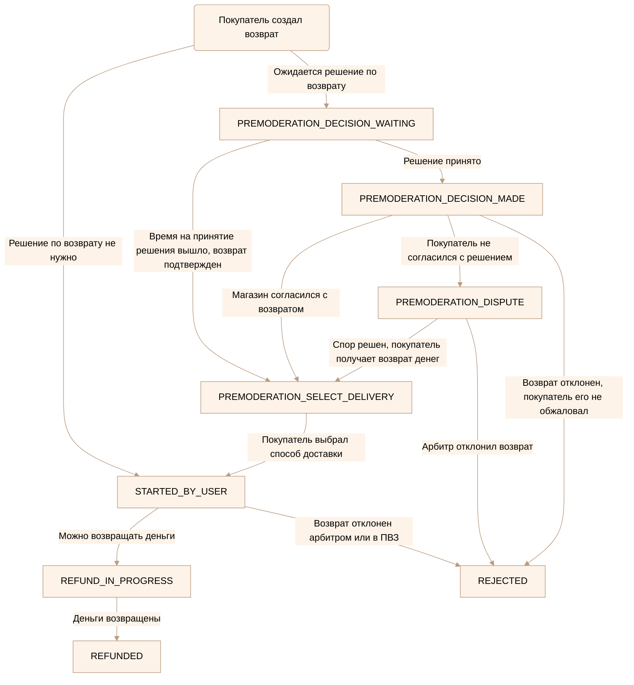

---
metadata:
  - name: generator
    content: Diplodoc Platform v5.57.3
alternate:
  - https://yandex.ru/dev/market/partner-api/doc/en/step-by-step/fby-fbs-express-return-status-model.md
  - https://yandex.ru/dev/market/partner-api/doc/ru/step-by-step/fby-fbs-express-return-status-model.md
  - https://yandex.ru/dev/market/partner-api/doc/zh/step-by-step/fby-fbs-express-return-status-model.md
  - href: ru/step-by-step/fby-fbs-express-return-status-model.md
    type: text/markdown
    title: Markdown version
  - href: ../llms.txt
    type: text/markdown
    title: llms.txt
---
> **Documentation Index:** Fetch the complete configuration index at https://yandex.ru/dev/market/partner-api/doc/ru/llms.txt

## Как изменяются статусы возвратов для моделей FBY, FBS и Экспресс

<!-- source: ru/_includes/mermaid/fby-fbs-express-return-status-graph.md -->

<!-- endsource: ru/_includes/mermaid/fby-fbs-express-return-status-graph.md -->
