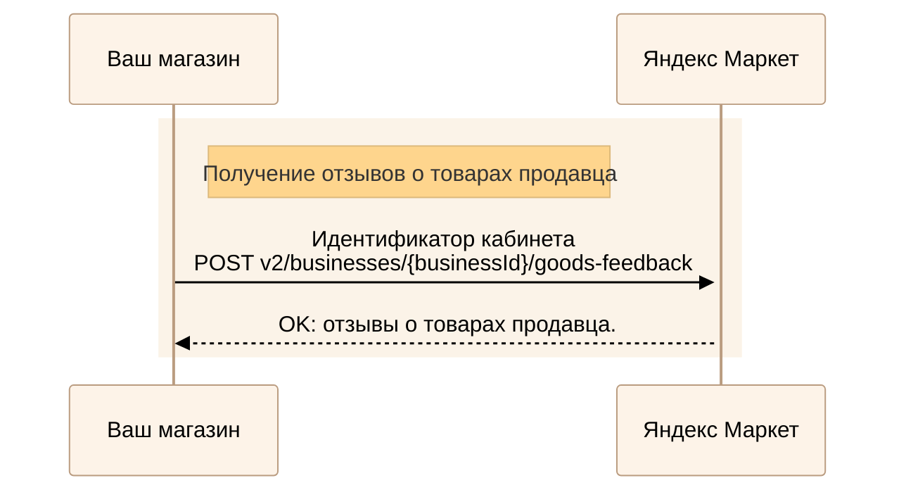
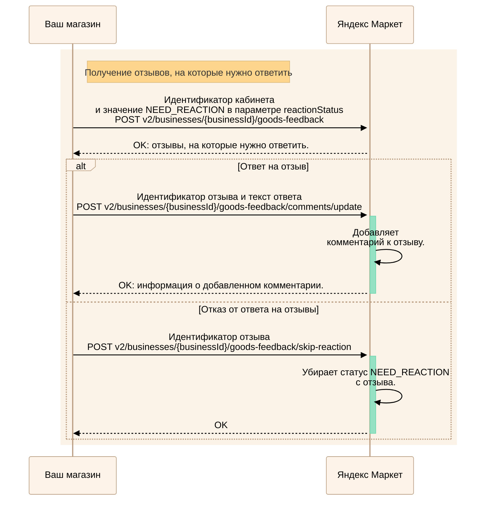
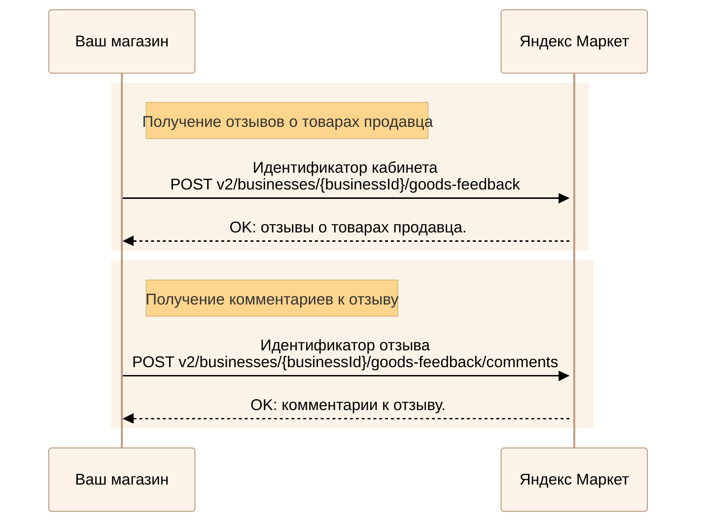
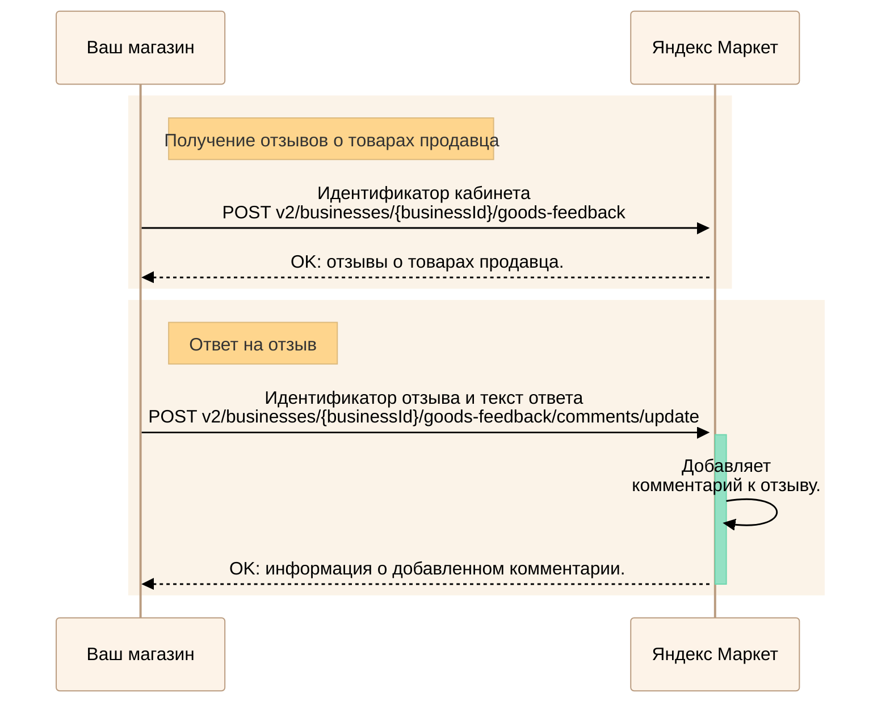
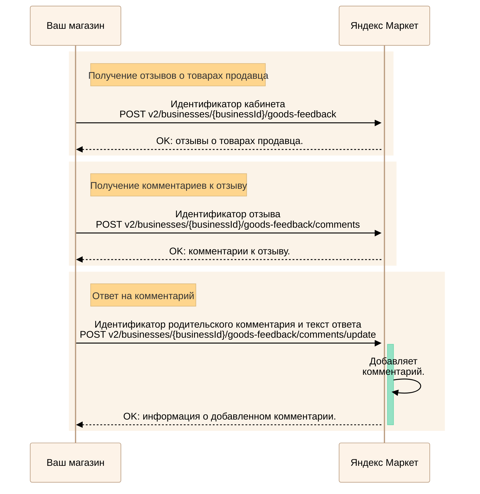
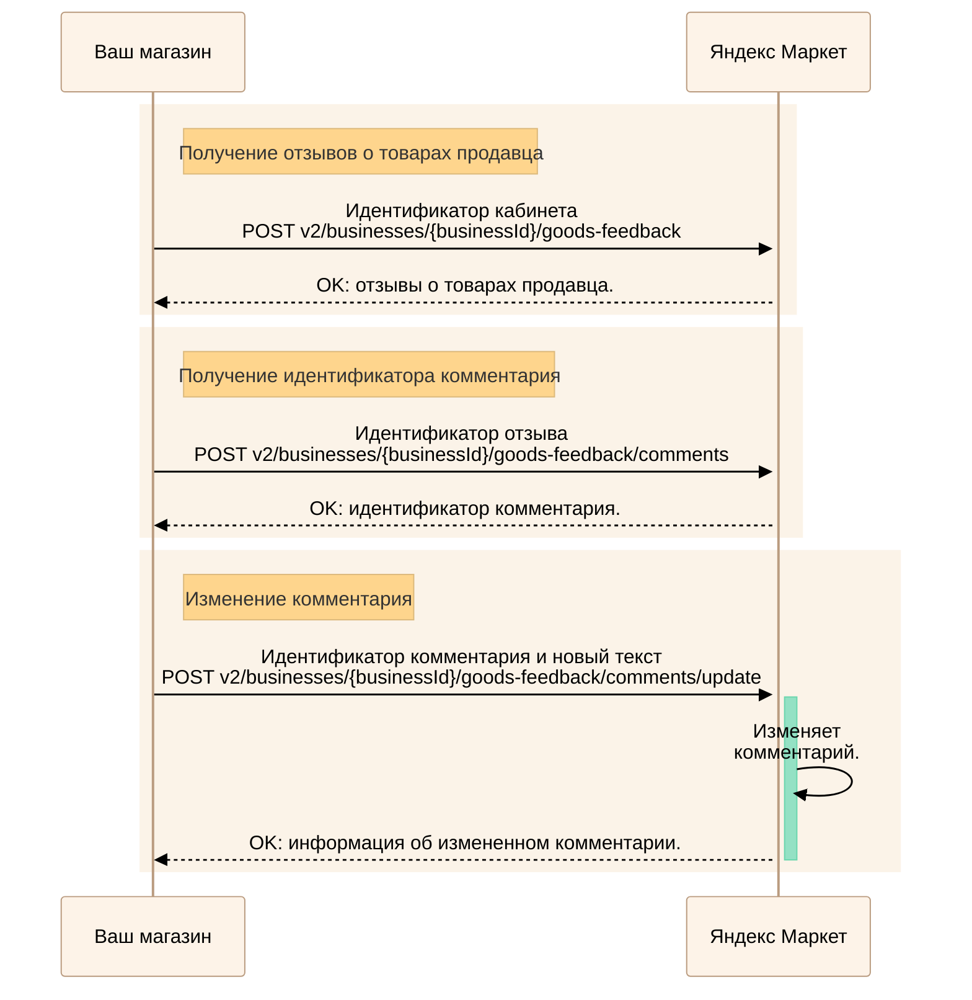
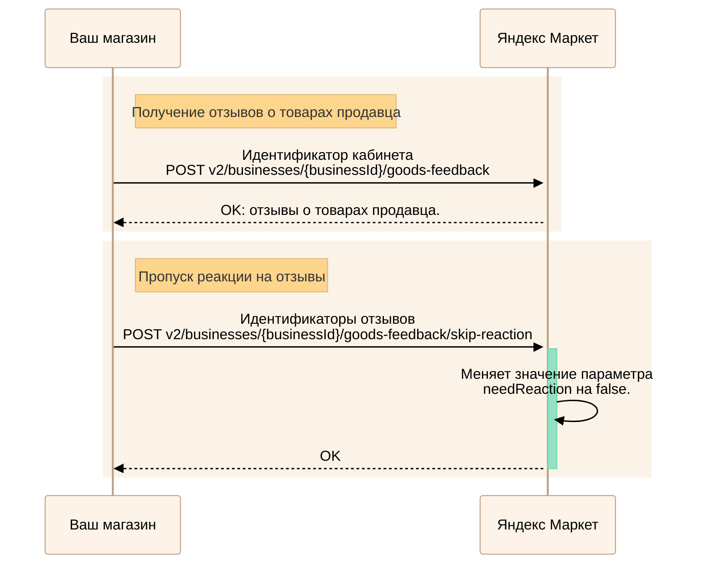
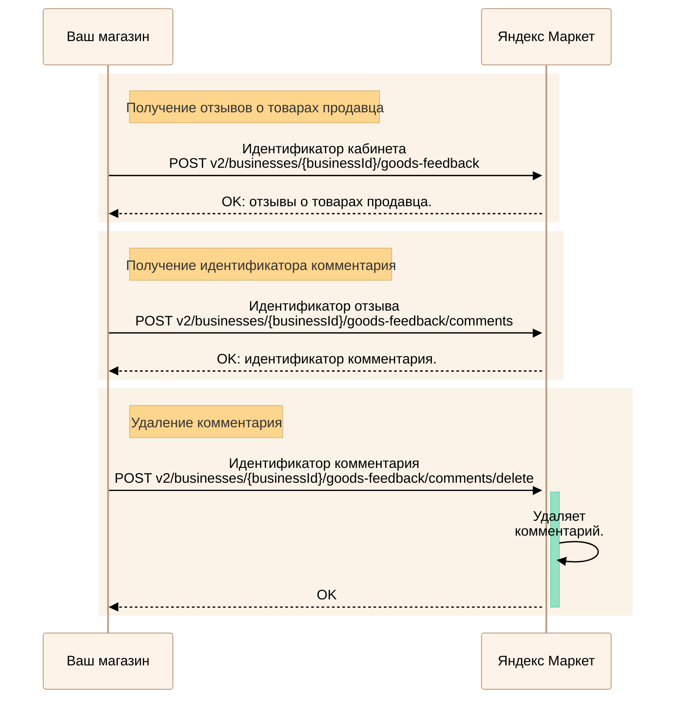

---
metadata:
  - name: generator
    content: Diplodoc Platform v5.57.3
alternate:
  - https://yandex.ru/dev/market/partner-api/doc/en/step-by-step/goods-feedback.md
  - https://yandex.ru/dev/market/partner-api/doc/ru/step-by-step/goods-feedback.md
  - https://yandex.ru/dev/market/partner-api/doc/zh/step-by-step/goods-feedback.md
  - href: ru/step-by-step/goods-feedback.md
    type: text/markdown
    title: Markdown version
  - href: ../llms.txt
    type: text/markdown
    title: llms.txt
---
> **Documentation Index:** Fetch the complete configuration index at https://yandex.ru/dev/market/partner-api/doc/ru/llms.txt

# Отзывы о товарах

API Маркета позволяет получать отзывы о товарах и комментарии к ним, а также добавлять комментарии магазина, изменять и удалять их.

## Получить отзывы о товарах {#all-feedbacks}



Маркет отправит вам запрос [POST notification](https://yandex.ru/dev/market/partner-api/doc/ru/push-notifications/reference/sendNotification.md), когда появится новый отзыв.

[Как работать с уведомлениями](https://yandex.ru/dev/market/partner-api/doc/ru/push-notifications/index.md)



<!-- source: ru/_includes/mermaid/all-goods-feedbacks.md -->

<!-- endsource: ru/_includes/mermaid/all-goods-feedbacks.md -->

Получите отзывы о товарах продавца с помощью запроса [POST v2/businesses/{businessId}/goods-feedback](https://yandex.ru/dev/market/partner-api/doc/ru/reference/goods-feedback/getGoodsFeedbacks.md). Чтобы вернулись отзывы об определенных товарах, в параметре `offerIds` передайте их идентификаторы. 

Результаты возвращаются постранично, одна страница содержит не более 50 отзывов.

## Получить отзывы, на которые нужно ответить {#need-reaction-feedbacks}

<!-- source: ru/_includes/mermaid/need-reaction-feedbacks.md -->

<!-- endsource: ru/_includes/mermaid/need-reaction-feedbacks.md -->

Получите отзывы, на которые нужно ответить, с помощью запроса [POST v2/businesses/{businessId}/goods-feedback](https://yandex.ru/dev/market/partner-api/doc/ru/reference/goods-feedback/getGoodsFeedbacks.md), где передайте значение `NEED_REACTION` в параметре `reactionStatus`.

Статус `NEED_REACTION` снимается после того, как вы ответите на отзыв или пропустите его. Если автор изменит отзыв, статус `NEED_REACTION` появится снова.

Чтобы оставить комментарий, передайте идентификатор отзыва, на который нужно ответить, и текст ответа в запросе [POST v2/businesses/{businessId}/goods-feedback/comments/update](https://yandex.ru/dev/market/partner-api/doc/ru/reference/goods-feedback/updateGoodsFeedbackComment.md).

Если вы не хотите отвечать на отзыв, пропустите его — передайте идентификатор отзыва в запросе [POST v2/businesses/{businessId}/goods-feedback/skip-reaction](https://yandex.ru/dev/market/partner-api/doc/ru/reference/goods-feedback/skipGoodsFeedbacksReaction.md).

## Получить комментарии о товарах {#all-comments}



Маркет отправит вам запрос [POST notification](https://yandex.ru/dev/market/partner-api/doc/ru/push-notifications/reference/sendNotification.md), когда появится новый комментарий.

[Как работать с уведомлениями](https://yandex.ru/dev/market/partner-api/doc/ru/push-notifications/index.md)



Если вы уже знаете идентификаторы отзывов, пропустите шаг их получения.

<!-- source: ru/_includes/mermaid/all-goods-comments.md -->

<!-- endsource: ru/_includes/mermaid/all-goods-comments.md -->

1. Получите отзывы о товарах продавца с помощью запроса [POST v2/businesses/{businessId}/goods-feedback](https://yandex.ru/dev/market/partner-api/doc/ru/reference/goods-feedback/getGoodsFeedbacks.md).
2. Передайте идентификатор отзыва в запросе [POST v2/businesses/{businessId}/goods-feedback/comments](https://yandex.ru/dev/market/partner-api/doc/ru/reference/goods-feedback/getGoodsFeedbackComments.md), чтобы увидеть комментарии к этому отзыву.

Результаты возвращаются постранично, одна страница содержит не более 50 комментариев.

## Отправить ответ на отзыв {#feedback-answer}

Если вы уже знаете идентификаторы отзывов, пропустите шаг их получения.

<!-- source: ru/_includes/mermaid/goods-feedback-answer.md -->

<!-- endsource: ru/_includes/mermaid/goods-feedback-answer.md -->

1. Получите отзывы о товарах продавца с помощью запроса [POST v2/businesses/{businessId}/goods-feedback](https://yandex.ru/dev/market/partner-api/doc/ru/reference/goods-feedback/getGoodsFeedbacks.md).
2. Передайте идентификатор отзыва, на который нужно ответить, и текст ответа в запросе [POST v2/businesses/{businessId}/goods-feedback/comments/update](https://yandex.ru/dev/market/partner-api/doc/ru/reference/goods-feedback/updateGoodsFeedbackComment.md).

## Отправить ответ на родительский комментарий {#comment-answer}

Если вы уже знаете идентификаторы отзывов и комментариев к отзыву, пропустите шаги их получения.

<!-- source: ru/_includes/mermaid/goods-feedback-comment-answer.md -->

<!-- endsource: ru/_includes/mermaid/goods-feedback-comment-answer.md -->

1. Получите отзывы о товарах продавца с помощью запроса [POST v2/businesses/{businessId}/goods-feedback](https://yandex.ru/dev/market/partner-api/doc/ru/reference/goods-feedback/getGoodsFeedbacks.md).
2. Передайте идентификатор отзыва в запросе [POST v2/businesses/{businessId}/goods-feedback/comments](https://yandex.ru/dev/market/partner-api/doc/ru/reference/goods-feedback/getGoodsFeedbackComments.md), чтобы увидеть комментарии к этому отзыву.
3. Передайте идентификатор родительского комментария, на который нужно ответить, и текст ответа в запросе [POST v2/businesses/{businessId}/goods-feedback/comments/update](https://yandex.ru/dev/market/partner-api/doc/ru/reference/goods-feedback/updateGoodsFeedbackComment.md).

## Изменить свой комментарий {#edit}



Параметр `canModify` в запросе [POST v2/businesses/{businessId}/goods-feedback/comments/update](https://yandex.ru/dev/market/partner-api/doc/ru/reference/goods-feedback/updateGoodsFeedbackComment.md) показывает, может ли продавец изменять комментарии.



Если вы уже знаете идентификаторы отзывов и комментариев к отзыву, пропустите шаги их получения.

<!-- source: ru/_includes/mermaid/goods-feedback-edit-answer.md -->

<!-- endsource: ru/_includes/mermaid/goods-feedback-edit-answer.md -->

1. Получите отзывы о товарах продавца с помощью запроса [POST v2/businesses/{businessId}/goods-feedback](https://yandex.ru/dev/market/partner-api/doc/ru/reference/goods-feedback/getGoodsFeedbacks.md).
2. Передайте идентификатор отзыва в запросе [POST v2/businesses/{businessId}/goods-feedback/comments](https://yandex.ru/dev/market/partner-api/doc/ru/reference/goods-feedback/getGoodsFeedbackComments.md), чтобы узнать идентификатор комментария, который нужно изменить.
3. Передайте идентификатор этого комментария и новый текст в запросе [POST v2/businesses/{businessId}/goods-feedback/comments/update](https://yandex.ru/dev/market/partner-api/doc/ru/reference/goods-feedback/updateGoodsFeedbackComment.md).

## Пропустить реакцию на отзывы {#skip-answer}

У переданных отзывов параметр `needReaction` будет принимать значение `false` в методе получения всех отзывов [POST v2/businesses/{businessId}/goods-feedback](https://yandex.ru/dev/market/partner-api/doc/ru/reference/goods-feedback/getGoodsFeedbacks.md).

Если вы уже знаете идентификаторы отзывов, пропустите шаг их получения.

<!-- source: ru/_includes/mermaid/goods-feedback-skip-answer.md -->

<!-- endsource: ru/_includes/mermaid/goods-feedback-skip-answer.md -->

1. Получите отзывы о товарах продавца с помощью запроса [POST v2/businesses/{businessId}/goods-feedback](https://yandex.ru/dev/market/partner-api/doc/ru/reference/goods-feedback/getGoodsFeedbacks.md).
2. Передайте идентификаторы отзывов, на которые не хотите отвечать, в запросе [POST v2/businesses/{businessId}/goods-feedback/skip-reaction](https://yandex.ru/dev/market/partner-api/doc/ru/reference/goods-feedback/skipGoodsFeedbacksReaction.md).

Если автор изменит отзыв, статус `NEED_REACTION` появится снова.

## Удалить свой комментарий {#delete}



Параметр `canModify` в запросе [POST v2/businesses/{businessId}/goods-feedback/comments/update](https://yandex.ru/dev/market/partner-api/doc/ru/reference/goods-feedback/updateGoodsFeedbackComment.md) показывает, может ли продавец удалять комментарии.



Если вы уже знаете идентификаторы отзывов и комментариев к отзыву, пропустите шаги их получения.

<!-- source: ru/_includes/mermaid/goods-feedback-delete-answer.md -->

<!-- endsource: ru/_includes/mermaid/goods-feedback-delete-answer.md -->

1. Получите отзывы о товарах продавца с помощью запроса [POST v2/businesses/{businessId}/goods-feedback](https://yandex.ru/dev/market/partner-api/doc/ru/reference/goods-feedback/getGoodsFeedbacks.md).
2. Передайте идентификатор отзыва в запросе [POST v2/businesses/{businessId}/goods-feedback/comments](https://yandex.ru/dev/market/partner-api/doc/ru/reference/goods-feedback/getGoodsFeedbackComments.md), чтобы узнать идентификатор комментария, который нужно удалить.
3. Передайте идентификатор этого комментария в запросе [POST v2/businesses/{businessId}/goods-feedback/comments/delete](https://yandex.ru/dev/market/partner-api/doc/ru/reference/goods-feedback/deleteGoodsFeedbackComment.md).
