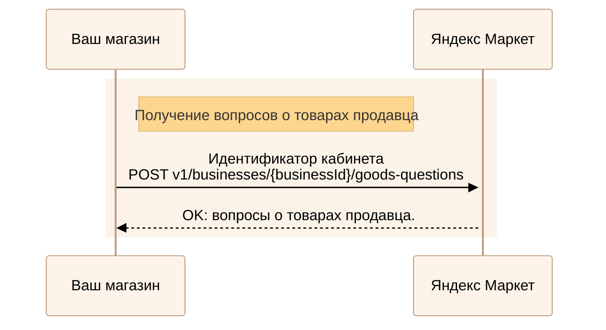
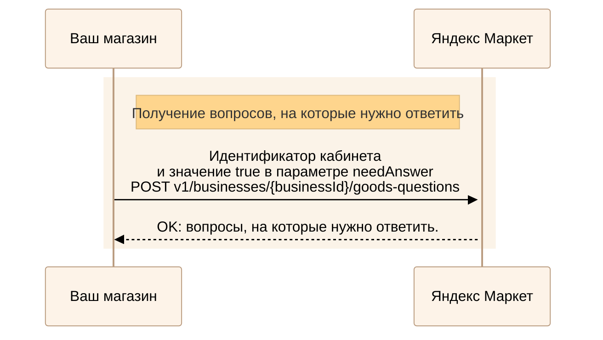
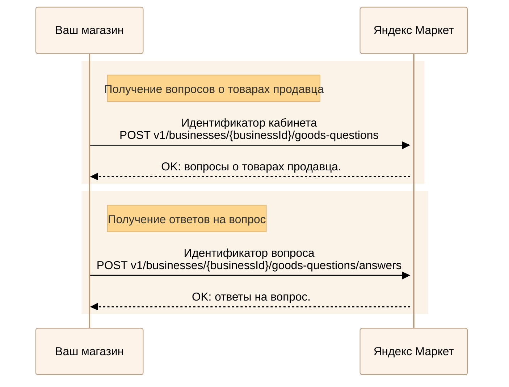
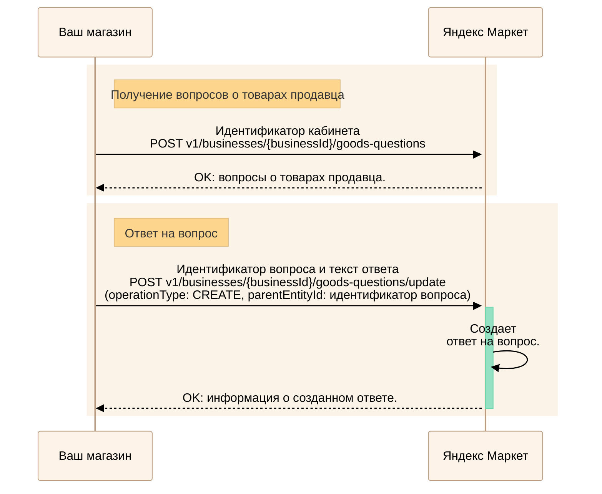
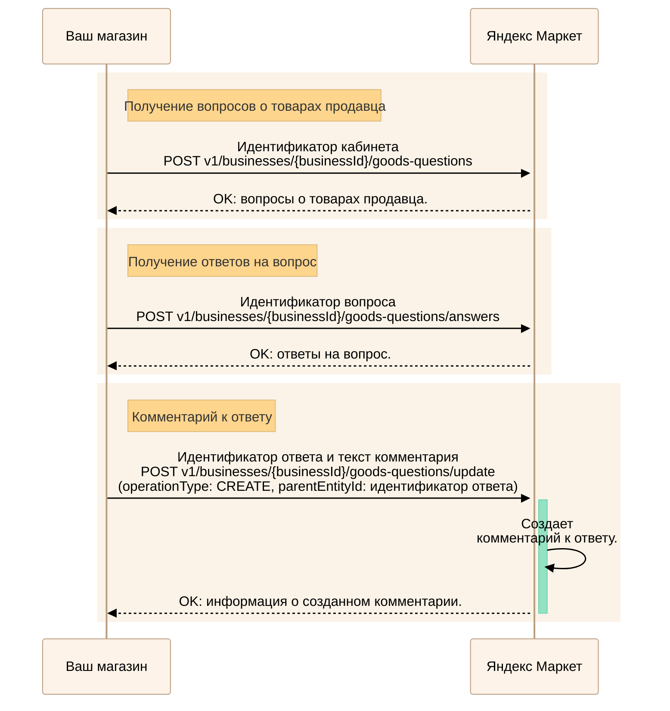
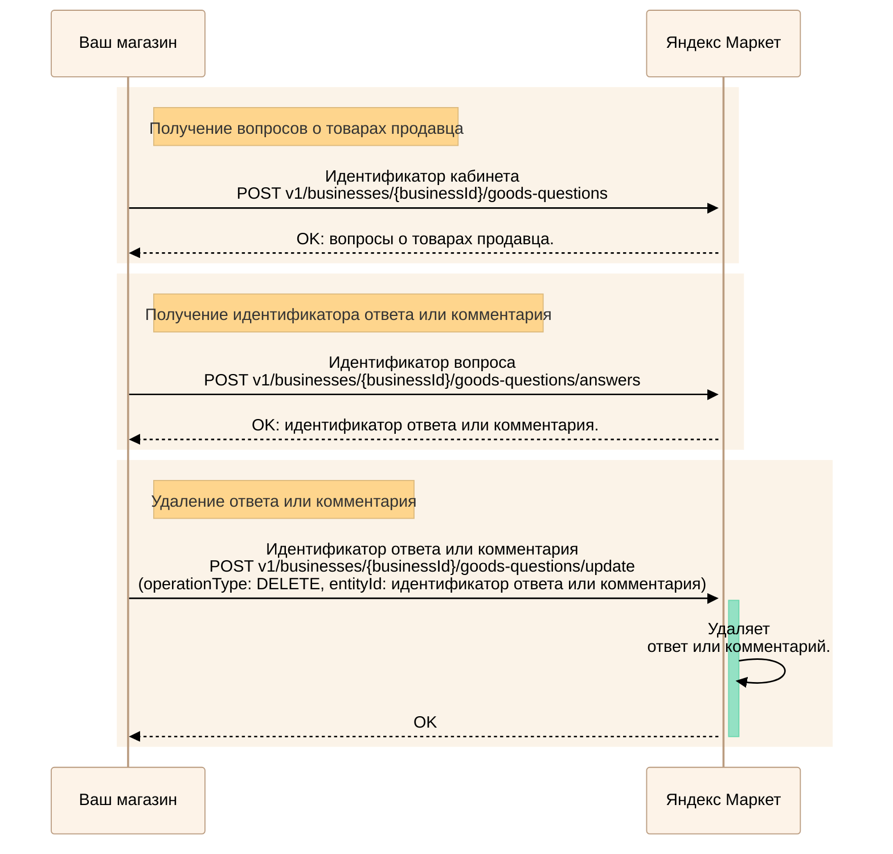

---
metadata:
  - name: generator
    content: Diplodoc Platform v5.55.3
alternate:
  - https://yandex.ru/dev/market/partner-api/doc/en/step-by-step/goods-questions.md
  - https://yandex.ru/dev/market/partner-api/doc/ru/step-by-step/goods-questions.md
  - https://yandex.ru/dev/market/partner-api/doc/zh/step-by-step/goods-questions.md
  - href: ru/step-by-step/goods-questions.md
    type: text/markdown
    title: Markdown version
  - href: ../llms.txt
    type: text/markdown
    title: llms.txt
---
> **Documentation Index:** Fetch the complete configuration index at https://yandex.ru/dev/market/partner-api/doc/ru/llms.txt

# Вопросы и ответы о товарах

API Маркета позволяет получать вопросы о товарах и ответы на них, а также добавлять ответы магазина, изменять и удалять их.

## Получить вопросы о товарах {#all-questions}

<!-- source: ru/_includes/mermaid/all-goods-questions.md -->

<!-- endsource: ru/_includes/mermaid/all-goods-questions.md -->

Получите вопросы о товарах продавца с помощью запроса [POST v1/businesses/{businessId}/goods-questions](https://yandex.ru/dev/market/partner-api/doc/ru/reference/goods-questions/getGoodsQuestions.md). Чтобы вернулись вопросы об определенных товарах, в параметре `offerIds` передайте их идентификаторы. 

Результаты возвращаются постранично, одна страница содержит не более 50 вопросов.

## Получить вопросы, на которые нужно ответить {#need-answer-questions}

<!-- source: ru/_includes/mermaid/unanswered-questions.md -->

<!-- endsource: ru/_includes/mermaid/unanswered-questions.md -->

Получите вопросы, на которые нужно ответить, с помощью запроса [POST v1/businesses/{businessId}/goods-questions](https://yandex.ru/dev/market/partner-api/doc/ru/reference/goods-questions/getGoodsQuestions.md), где передайте значение `false` в параметре `answered`.

Чтобы оставить ответ, передайте идентификатор вопроса, на который нужно ответить, и текст ответа в запросе [POST v1/businesses/{businessId}/goods-questions/update](https://yandex.ru/dev/market/partner-api/doc/ru/reference/goods-questions/updateGoodsQuestionTextEntity.md) с параметром `operationType: CREATE` и `parentEntityId` равным идентификатору вопроса.

## Получить ответы на вопрос {#all-answers}

Если вы уже знаете идентификаторы вопросов, пропустите шаг их получения.

<!-- source: ru/_includes/mermaid/all-goods-question-answers.md -->

<!-- endsource: ru/_includes/mermaid/all-goods-question-answers.md -->

1. Получите вопросы о товарах продавца с помощью запроса [POST v1/businesses/{businessId}/goods-questions](https://yandex.ru/dev/market/partner-api/doc/ru/reference/goods-questions/getGoodsQuestions.md).
2. Передайте идентификатор вопроса в запросе [POST v1/businesses/{businessId}/goods-questions/answers](https://yandex.ru/dev/market/partner-api/doc/ru/reference/goods-questions/getGoodsQuestionAnswers.md), чтобы увидеть ответы на этот вопрос.

Результаты возвращаются постранично, одна страница содержит не более 50 ответов.

## Отправить ответ на вопрос {#question-answer}

Если вы уже знаете идентификаторы вопросов, пропустите шаг их получения.

<!-- source: ru/_includes/mermaid/goods-question-answer.md -->

<!-- endsource: ru/_includes/mermaid/goods-question-answer.md -->

1. Получите вопросы о товарах продавца с помощью запроса [POST v1/businesses/{businessId}/goods-questions](https://yandex.ru/dev/market/partner-api/doc/ru/reference/goods-questions/getGoodsQuestions.md).
2. Передайте идентификатор вопроса, на который нужно ответить, и текст ответа в запросе [POST v1/businesses/{businessId}/goods-questions/update](https://yandex.ru/dev/market/partner-api/doc/ru/reference/goods-questions/updateGoodsQuestionTextEntity.md) с параметром `operationType: CREATE` и `parentEntityId` равным идентификатору вопроса.

## Отправить комментарий к ответу {#answer-comment}

Если вы уже знаете идентификаторы вопросов и ответов на вопрос, пропустите шаги их получения.

<!-- source: ru/_includes/mermaid/goods-question-comment-answer.md -->

<!-- endsource: ru/_includes/mermaid/goods-question-comment-answer.md -->

1. Получите вопросы о товарах продавца с помощью запроса [POST v1/businesses/{businessId}/goods-questions](https://yandex.ru/dev/market/partner-api/doc/ru/reference/goods-questions/getGoodsQuestions.md).
2. Передайте идентификатор вопроса в запросе [POST v1/businesses/{businessId}/goods-questions/answers](https://yandex.ru/dev/market/partner-api/doc/ru/reference/goods-questions/getGoodsQuestionAnswers.md), чтобы увидеть ответы на этот вопрос.
3. Передайте идентификатор ответа, к которому нужно добавить комментарий, и текст комментария в запросе [POST v1/businesses/{businessId}/goods-questions/update](https://yandex.ru/dev/market/partner-api/doc/ru/reference/goods-questions/updateGoodsQuestionTextEntity.md) с параметром `operationType: CREATE` и `parentEntityId` равным идентификатору ответа.

## Изменить свой ответ или комментарий {#edit}



Параметр `canModify` в запросе [POST v1/businesses/{businessId}/goods-questions/answers](https://yandex.ru/dev/market/partner-api/doc/ru/reference/goods-questions/getGoodsQuestionAnswers.md) показывает, может ли продавец изменять ответы и комментарии.



Если вы уже знаете идентификаторы вопросов и ответов на вопрос, пропустите шаги их получения.

<!-- source: ru/_includes/mermaid/goods-question-edit-answer.md -->

<!-- endsource: ru/_includes/mermaid/goods-question-edit-answer.md -->

1. Получите вопросы о товарах продавца с помощью запроса [POST v1/businesses/{businessId}/goods-questions](https://yandex.ru/dev/market/partner-api/doc/ru/reference/goods-questions/getGoodsQuestions.md).
2. Передайте идентификатор вопроса в запросе [POST v1/businesses/{businessId}/goods-questions/answers](https://yandex.ru/dev/market/partner-api/doc/ru/reference/goods-questions/getGoodsQuestionAnswers.md), чтобы узнать идентификатор ответа или комментария, который нужно изменить.
3. Передайте идентификатор этого ответа или комментария и новый текст в запросе [POST v1/businesses/{businessId}/goods-questions/update](https://yandex.ru/dev/market/partner-api/doc/ru/reference/goods-questions/updateGoodsQuestionTextEntity.md) с параметром `operationType: UPDATE` и `entityId` равным идентификатору ответа или комментария.

## Удалить свой ответ или комментарий {#delete}



Параметр `canModify` в запросе [POST v1/businesses/{businessId}/goods-questions/answers](https://yandex.ru/dev/market/partner-api/doc/ru/reference/goods-questions/getGoodsQuestionAnswers.md) показывает, может ли продавец удалять ответы и комментарии.



Если вы уже знаете идентификаторы вопросов и ответов на вопрос, пропустите шаги их получения.

<!-- source: ru/_includes/mermaid/goods-question-delete-answer.md -->

<!-- endsource: ru/_includes/mermaid/goods-question-delete-answer.md -->

1. Получите вопросы о товарах продавца с помощью запроса [POST v1/businesses/{businessId}/goods-questions](https://yandex.ru/dev/market/partner-api/doc/ru/reference/goods-questions/getGoodsQuestions.md).
2. Передайте идентификатор вопроса в запросе [POST v1/businesses/{businessId}/goods-questions/answers](https://yandex.ru/dev/market/partner-api/doc/ru/reference/goods-questions/getGoodsQuestionAnswers.md), чтобы узнать идентификатор ответа или комментария, который нужно удалить.
3. Передайте идентификатор этого ответа или комментария в запросе [POST v1/businesses/{businessId}/goods-questions/update](https://yandex.ru/dev/market/partner-api/doc/ru/reference/goods-questions/updateGoodsQuestionTextEntity.md) с параметром `operationType: DELETE` и `entityId` равным идентификатору ответа или комментария.
