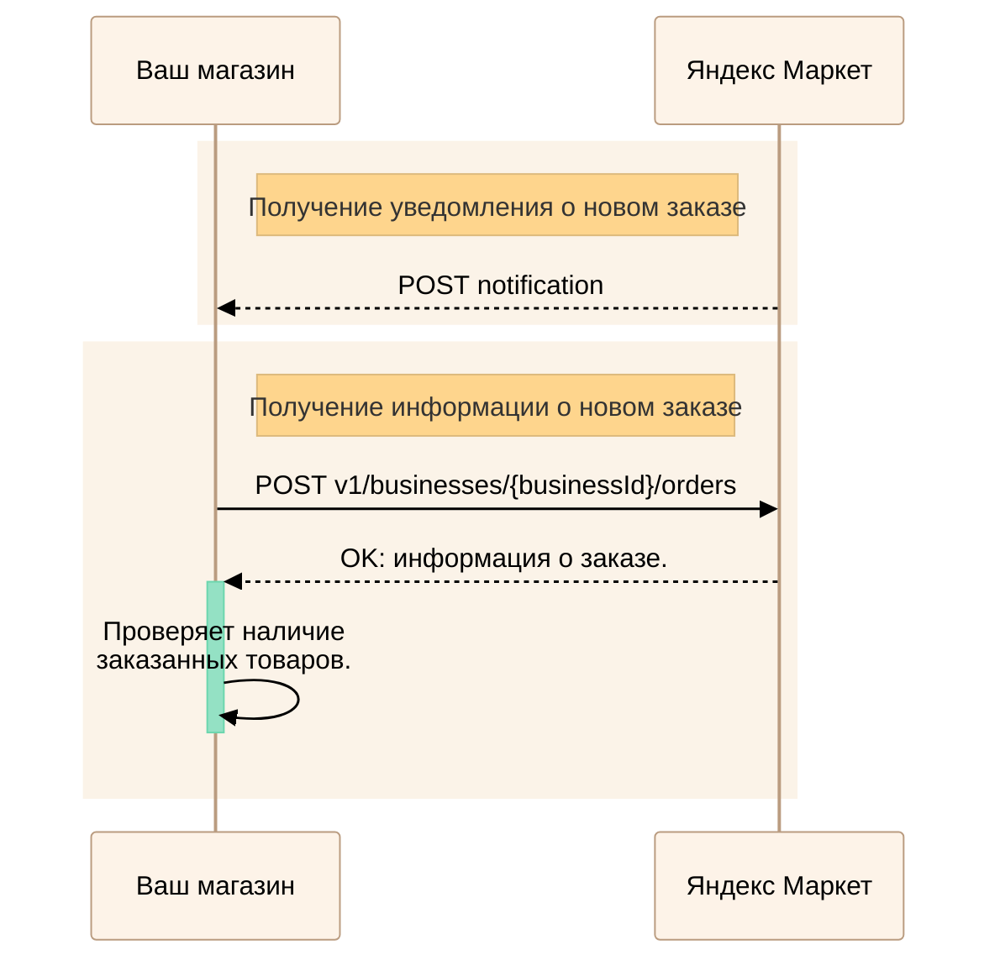
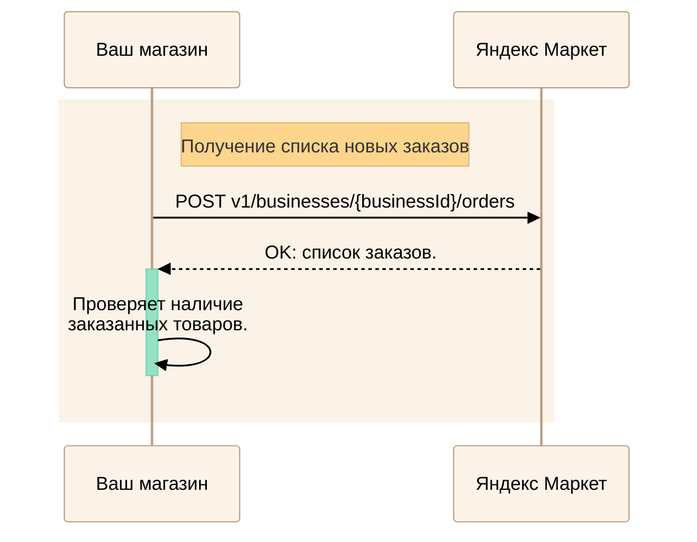

---
metadata:
  - name: generator
    content: Diplodoc Platform v5.57.3
alternate:
  - https://yandex.ru/dev/market/partner-api/doc/en/step-by-step/orders-receive.md
  - https://yandex.ru/dev/market/partner-api/doc/ru/step-by-step/orders-receive.md
  - https://yandex.ru/dev/market/partner-api/doc/zh/step-by-step/orders-receive.md
  - href: https://yandex.ru/dev/market/partner-api/doc/ru/step-by-step/orders-receive.md
    type: text/markdown
    title: Markdown version
  - href: https://yandex.ru/dev/market/partner-api/doc/ru/llms.txt
    type: text/markdown
    title: llms.txt
---
> **Documentation Index:** Fetch the complete configuration index at https://yandex.ru/dev/market/partner-api/doc/ru/llms.txt

# Получение заказов: опрос API или уведомления

Выберите один из способов: API‑уведомления (рекомендуется) или через регулярный опрос информации по заказам.

## Способ 1. API‑уведомления

<!-- source: ru/_includes/mermaid/orders-receive-notification.md -->

<!-- endsource: ru/_includes/mermaid/orders-receive-notification.md -->

- Подключите прием запросов [POST notification](https://yandex.ru/dev/market/partner-api/doc/ru/push-notifications/reference/sendNotification.md). Как работать с уведомлениями: [Инструкция](https://yandex.ru/dev/market/partner-api/doc/ru/push-notifications/index.md)
- Получайте события о заказах и сразу запрашивайте подробности: [POST v1/businesses/{businessId}/orders](https://yandex.ru/dev/market/partner-api/doc/ru/reference/orders/getBusinessOrders.md)
- Типы уведомлений и формат данных: [POST notification](https://yandex.ru/dev/market/partner-api/doc/ru/push-notifications/reference/sendNotification.md)

## Способ 2. Регулярный опрос API

<!-- source: ru/_includes/mermaid/orders-receive-poll.md -->

<!-- endsource: ru/_includes/mermaid/orders-receive-poll.md -->

- Запрашивайте списки заказов:
  - [POST v1/businesses/{businessId}/orders](https://yandex.ru/dev/market/partner-api/doc/ru/reference/orders/getBusinessOrders.md)
- Используйте фильтры:
  - `fromDate` и `toDate` — диапазон дат доставки для выборки новых заказов
  - `updatedAtFrom` и `updatedAtTo` — выборка заказов с изменениями
- Соблюдайте интервалы опроса:
  - Экспресс — каждые 10-15 минут
  - FBS, DBS — не реже одного раза в час
- Для обработки определенного заказа получите детали с помощью метода [POST v1/businesses/{businessId}/orders](https://yandex.ru/dev/market/partner-api/doc/ru/reference/orders/getBusinessOrders.md)
