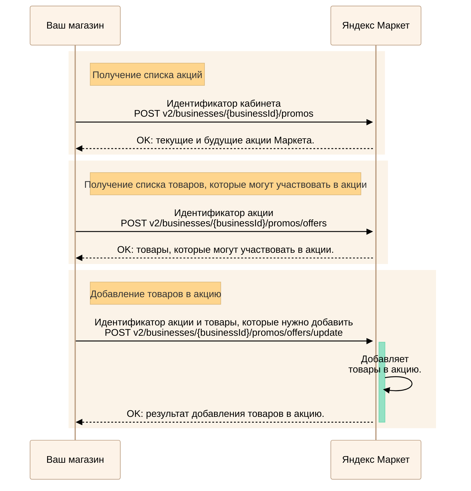
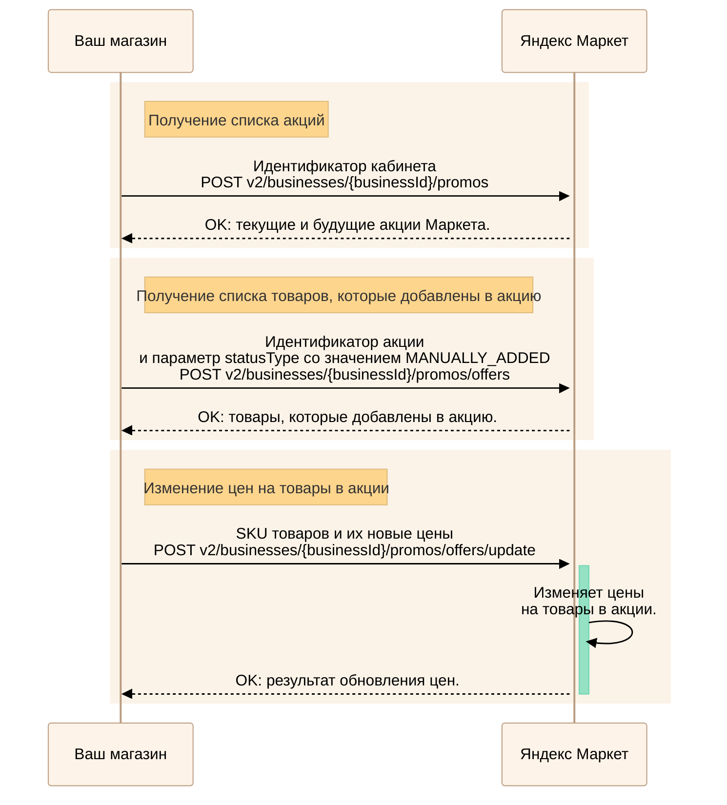
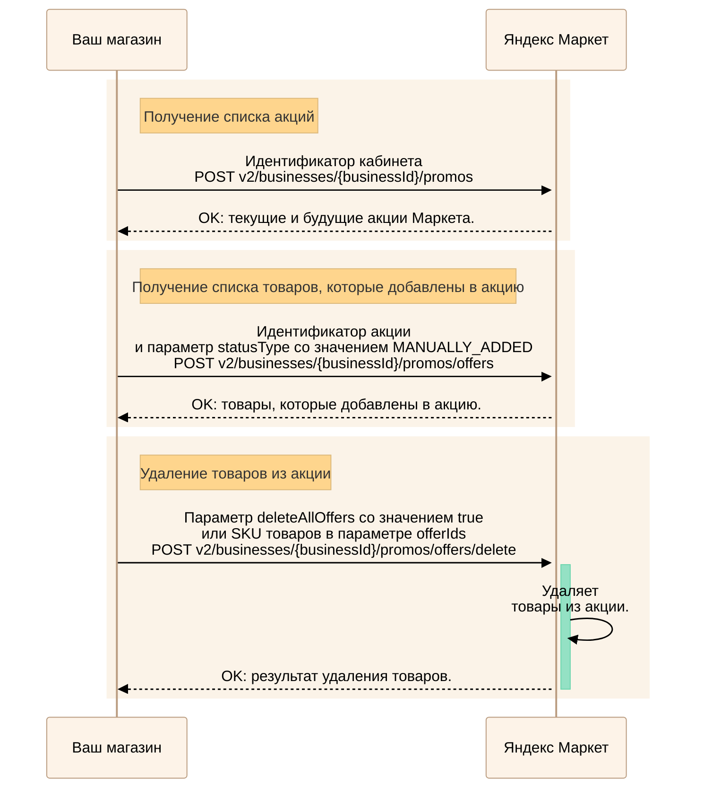

---
metadata:
  - name: generator
    content: Diplodoc Platform v5.61.0
alternate:
  - https://yandex.ru/dev/market/partner-api/doc/en/step-by-step/promos.md
  - https://yandex.ru/dev/market/partner-api/doc/ru/step-by-step/promos.md
  - https://yandex.ru/dev/market/partner-api/doc/zh/step-by-step/promos.md
  - href: https://yandex.ru/dev/market/partner-api/doc/ru/step-by-step/promos.md
    type: text/markdown
    title: Markdown version
  - href: https://yandex.ru/dev/market/partner-api/doc/ru/llms.txt
    rel: describedby
---
> **Documentation Index:** Fetch the complete configuration index at https://yandex.ru/dev/market/partner-api/doc/ru/llms.txt

# Управление акциями

API Маркета позволяет получать информацию об акциях Маркета и принимать в них участие.

## Добавить товары в акцию {#add-goods}



Пропустите шаги их получения.



<!-- source: ru/_includes/mermaid/promo-add-goods.md -->

<!-- endsource: ru/_includes/mermaid/promo-add-goods.md -->

1. Получите список акций Маркета с помощью запроса [POST v2/businesses/{businessId}/promos](https://yandex.ru/dev/market/partner-api/doc/ru/reference/promos/getPromos.md).
2. Передайте идентификатор акции в запросе [POST v2/businesses/{businessId}/promos/offers](https://yandex.ru/dev/market/partner-api/doc/ru/reference/promos/getPromoOffers.md), чтобы узнать, какие товары могут участвовать в акции.
3. Выполните запрос [POST v2/businesses/{businessId}/promos/offers/update](https://yandex.ru/dev/market/partner-api/doc/ru/reference/promos/updatePromoOffers.md), где передайте идентификатор акции и товары, которые необходимо добавить.

## Изменить цену товаров, которые уже добавлены в акцию {#change-price}



Пропустите шаги их получения.



<!-- source: ru/_includes/mermaid/promo-change-price.md -->

<!-- endsource: ru/_includes/mermaid/promo-change-price.md -->

1. Получите список акций Маркета с помощью запроса [POST v2/businesses/{businessId}/promos](https://yandex.ru/dev/market/partner-api/doc/ru/reference/promos/getPromos.md).
2. Передайте идентификатор акции и параметр `statusType` со значением `MANUALLY_ADDED` в запросе [POST v2/businesses/{businessId}/promos/offers](https://yandex.ru/dev/market/partner-api/doc/ru/reference/promos/getPromoOffers.md), чтобы узнать, какие товары добавлены в акцию.
3. Передайте SKU товаров и их новые цены — запрос [POST v2/businesses/{businessId}/promos/offers/update](https://yandex.ru/dev/market/partner-api/doc/ru/reference/promos/updatePromoOffers.md).

## Удалить товары из акции {#delete-goods}



Пропустите шаги их получения.



<!-- source: ru/_includes/mermaid/promo-delete-goods.md -->

<!-- endsource: ru/_includes/mermaid/promo-delete-goods.md -->

1. Получите список акций Маркета с помощью запроса [POST v2/businesses/{businessId}/promos](https://yandex.ru/dev/market/partner-api/doc/ru/reference/promos/getPromos.md).
2. Передайте идентификатор акции и параметр `statusType` со значением `MANUALLY_ADDED` в запросе [POST v2/businesses/{businessId}/promos/offers](https://yandex.ru/dev/market/partner-api/doc/ru/reference/promos/getPromoOffers.md), чтобы узнать, какие товары добавлены в акцию.
3. Выполните запрос [POST v2/businesses/{businessId}/promos/offers/delete](https://yandex.ru/dev/market/partner-api/doc/ru/reference/promos/deletePromoOffers.md), чтобы удалить из акции:

    * все товары — параметр `deleteAllOffers` со значением `true`;
    * некоторые товары — параметр `offerIds`.

## Посмотреть результаты участия в акции {#promo-results}

Вы можете скачать отчет со всеми заказами, в которых есть проданные по акции товары. О том, как получать отчеты, читайте в [пошаговой инструкции](https://yandex.ru/dev/market/partner-api/doc/ru/step-by-step/reports.md).
