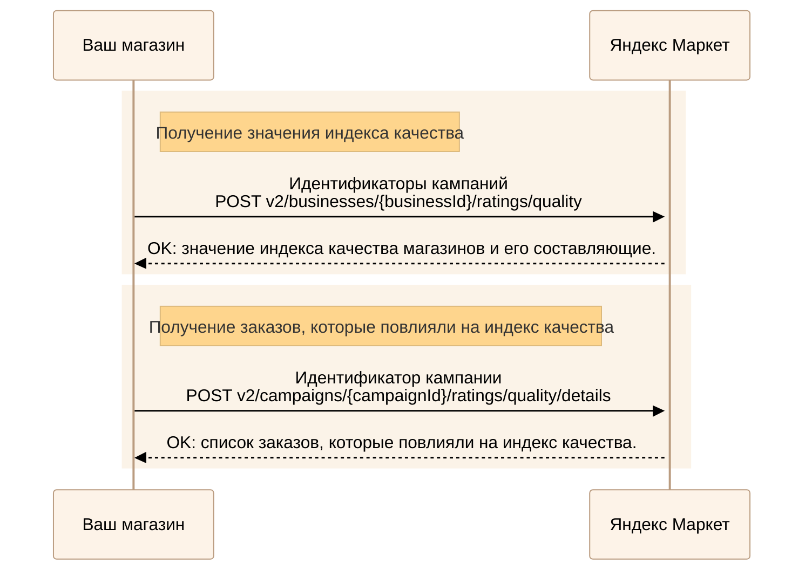

---
metadata:
  - name: generator
    content: Diplodoc Platform v5.61.0
alternate:
  - https://yandex.ru/dev/market/partner-api/doc/en/step-by-step/ratings.md
  - https://yandex.ru/dev/market/partner-api/doc/ru/step-by-step/ratings.md
  - https://yandex.ru/dev/market/partner-api/doc/zh/step-by-step/ratings.md
  - href: https://yandex.ru/dev/market/partner-api/doc/ru/step-by-step/ratings.md
    type: text/markdown
    title: Markdown version
  - href: https://yandex.ru/dev/market/partner-api/doc/ru/llms.txt
    rel: describedby
---
> **Documentation Index:** Fetch the complete configuration index at https://yandex.ru/dev/market/partner-api/doc/ru/llms.txt

# Индекс качества

Через API можно узнать:

* значение индекса качества магазинов и его составляющие;
* информацию по заказам, которые повлияли на индекс качества.

Подробнее об индексе качества читайте [в Справке Маркета для продавцов](https://yandex.ru/support2/marketplace/ru/quality/score/).

<!-- source: ru/_includes/mermaid/ratings.md -->

<!-- endsource: ru/_includes/mermaid/ratings.md -->

1. Чтобы узнать значение индекса качества, передайте идентификаторы кампаний в запросе [POST v2/businesses/{businessId}/ratings/quality](https://yandex.ru/dev/market/partner-api/doc/ru/reference/ratings/getQualityRatings.md).
2. Получить информацию по заказам, которые повлияли на индекс качества магазина, можно с помощью запроса [POST v2/campaigns/{campaignId}/ratings/quality/details](https://yandex.ru/dev/market/partner-api/doc/ru/reference/ratings/getQualityRatingDetails.md).
