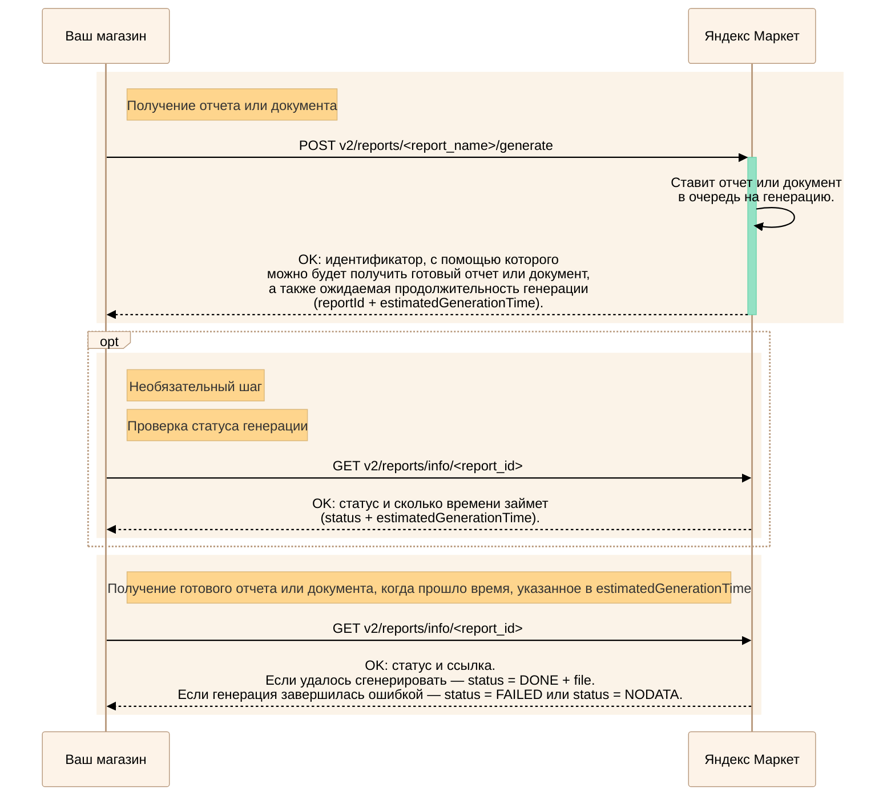

---
metadata:
  - name: generator
    content: Diplodoc Platform v5.55.3
alternate:
  - https://yandex.ru/dev/market/partner-api/doc/en/step-by-step/reports.md
  - https://yandex.ru/dev/market/partner-api/doc/ru/step-by-step/reports.md
  - https://yandex.ru/dev/market/partner-api/doc/zh/step-by-step/reports.md
  - href: ru/step-by-step/reports.md
    type: text/markdown
    title: Markdown version
  - href: ../llms.txt
    type: text/markdown
    title: llms.txt
---
> **Documentation Index:** Fetch the complete configuration index at https://yandex.ru/dev/market/partner-api/doc/ru/llms.txt

# Как получать отчеты и документы

API Маркета позволяет получать отчеты и документы. [Их типы](#generate)

Генерация занимает время, поэтому сначала нужно сделать запрос на саму генерацию, а потом на получение готового отчета или документа.

<!-- source: ru/_includes/mermaid/reports.md -->

<!-- endsource: ru/_includes/mermaid/reports.md -->

## Как заказать отчет или документ {#generate}

Сделайте запрос, соответствующий типу нужного отчета или документа. В запросе задайте настройки и фильтры, а также укажите формат, в котором вы хотите получить результат. Доступные форматы указаны в описании каждого метода.

#|
|| **Тип отчета или документа**                  | **Как запустить генерацию**                                                                                                 ||
|| Отчет по схождению с закрывающими документами |[POST v2/reports/closure-documents/detalization/generate](https://yandex.ru/dev/market/partner-api/doc/ru/reference/reports/generateClosureDocumentsDetalizationReport.md)||
|| Отчет по счету маркетинга                     |[POST v1/businesses/{businessId}/reports/marketing-detalization/generate](https://yandex.ru/dev/market/partner-api/doc/ru/reference/reports/generateMarketingDetalizationReport.md)||
|| Отчет по охватному продвижению                |[POST v2/reports/banners-statistics/generate](https://yandex.ru/dev/market/partner-api/doc/ru/reference/reports/generateBannersStatisticsReport.md)                       ||
|| Отчет по бусту показов                        |[POST v2/reports/shows-boost/generate](https://yandex.ru/dev/market/partner-api/doc/ru/reference/reports/generateShowsBoostReport.md)                                     ||
|| Отчет по бусту продаж                         |[POST v2/reports/boost-consolidated/generate](https://yandex.ru/dev/market/partner-api/doc/ru/reference/reports/generateBoostConsolidatedReport.md)                       ||
|| Отчет по полкам                               |[POST v2/reports/shelf-statistics/generate](https://yandex.ru/dev/market/partner-api/doc/ru/reference/reports/generateShelfsStatisticsReport.md)                          ||
|| Закрывающие документы                         |[POST v2/reports/closure-documents/generate](https://yandex.ru/dev/market/partner-api/doc/ru/reference/reports/generateClosureDocumentsReport.md)                         ||
|| Лист сборки                                   |[POST v2/reports/documents/shipment-list/generate](https://yandex.ru/dev/market/partner-api/doc/ru/reference/reports/generateShipmentListDocumentReport.md)             ||
|| Файл со штрихкодами товаров                   |[POST v1/reports/documents/barcodes/generate](https://yandex.ru/dev/market/partner-api/doc/ru/reference/reports/generateBarcodesReport.md)                                ||
|| Отчет «Аналитика продаж»                      |[POST v2/reports/shows-sales/generate](https://yandex.ru/dev/market/partner-api/doc/ru/reference/reports/generateShowsSalesReport.md)                                     ||
|| Отчет по географии продаж                     |[POST v2/reports/sales-geography/generate](https://yandex.ru/dev/market/partner-api/doc/ru/reference/reports/generateSalesGeographyReport.md)                                ||
|| Отчет по движению товаров                     |[POST v2/reports/goods-movement/generate](https://yandex.ru/dev/market/partner-api/doc/ru/reference/reports/generateGoodsMovementReport.md)                               ||
|| Отчет по заказам                              |[POST v2/reports/united-orders/generate](https://yandex.ru/dev/market/partner-api/doc/ru/reference/reports/generateUnitedOrdersReport.md)                                 ||
|| Отчет по заказам с ювелирными изделиями       |[POST v2/reports/jewelry-fiscal/generate](https://yandex.ru/dev/market/partner-api/doc/ru/reference/reports/generateJewelryFiscalReport.md)                               ||
|| Отчет по ключевым показателям                 |[POST v2/reports/key-indicators/generate](https://yandex.ru/dev/market/partner-api/doc/ru/reference/reports/generateKeyIndicatorsReport.md)                               ||
|| Отчет «Конкурентная позиция»                  |[POST v2/reports/competitors-position/generate](https://yandex.ru/dev/market/partner-api/doc/ru/reference/reports/generateCompetitorsPositionReport.md)                   ||
|| Отчет по невыкупам и возвратам                |[POST v2/reports/united-returns/generate](https://yandex.ru/dev/market/partner-api/doc/ru/reference/reports/generateUnitedReturnsReport.md)                               ||
|| Отчет по оборачиваемости                      |[POST v2/reports/goods-turnover/generate](https://yandex.ru/dev/market/partner-api/doc/ru/reference/reports/generateGoodsTurnoverReport.md)                               ||
|| Отчет по остаткам на складах                  |[POST v2/reports/stocks-on-warehouses/generate](https://yandex.ru/dev/market/partner-api/doc/ru/reference/reports/generateStocksOnWarehousesReport.md)                    ||
|| Отчет по отзывам о товарах                    |[POST v2/reports/goods-feedback/generate](https://yandex.ru/dev/market/partner-api/doc/ru/reference/reports/generateGoodsFeedbackReport.md)                               ||
|| Отчет по платежам:

  * о платежах за период;
  * о платежном поручении;
  * о баллах Маркета.                            |[POST v2/reports/united-netting/generate](https://yandex.ru/dev/market/partner-api/doc/ru/reference/reports/generateUnitedNettingReport.md)                               ||
|| Отчет по реализации                           |[POST v2/reports/goods-realization/generate](https://yandex.ru/dev/market/partner-api/doc/ru/reference/reports/generateGoodsRealizationReport.md)                         ||
|| Отчет по стоимости услуг:

  * по дате начисления услуги;
  * по дате формирования акта.                   |[POST v2/reports/united-marketplace-services/generate](https://yandex.ru/dev/market/partner-api/doc/ru/reference/reports/generateUnitedMarketplaceServicesReport.md)      ||

|| Отчет «Цены»                                  |[POST v2/reports/goods-prices/generate](https://yandex.ru/dev/market/partner-api/doc/ru/reference/reports/generateGoodsPricesReport.md)                                   ||
|| Ярлыки на все коробки в нескольких заказах    |[POST v2/reports/documents/labels/generate](https://yandex.ru/dev/market/partner-api/doc/ru/reference/reports/generateMassOrderLabelsReport.md)                            ||
|#

## Как узнать, что отчет или документ готов {#status}

Сделайте запрос [GET v2/reports/info/{reportId}](https://yandex.ru/dev/market/partner-api/doc/ru/reference/reports/getReportInfo.md).

Вы получите статус генерации отчета или документа и примерное время, оставшееся до завершения генерации.

## Как получить готовый отчет или документ {#get}

После того как время на генерацию закончится, повторите запрос [GET v2/reports/info/{reportId}](https://yandex.ru/dev/market/partner-api/doc/ru/reference/reports/getReportInfo.md).  Если отчет или документ удалось сгенерировать, вы получите ссылку на его скачивание.    Ссылка актуальна **60 минут** с момента получения ответа. При каждом запросе `GET /v2/reports/info/{reportId}` генерируется новая подписанная ссылка, срок действия которой ограничен.  **Рекомендация для интеграций:** сразу после получения ссылки скачайте отчет и сохраните его у себя. Не сохраняйте ссылку для последующего использования — она станет недействительной после истечения срока действия.  
