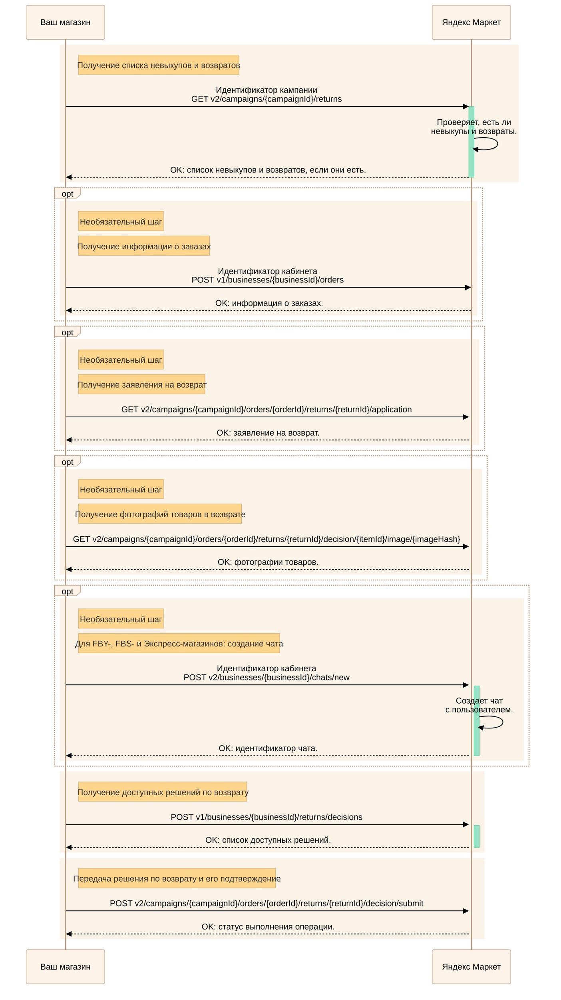

---
metadata:
  - name: generator
    content: Diplodoc Platform v5.61.1
alternate:
  - https://yandex.ru/dev/market/partner-api/doc/en/step-by-step/returns.md
  - https://yandex.ru/dev/market/partner-api/doc/ru/step-by-step/returns.md
  - https://yandex.ru/dev/market/partner-api/doc/zh/step-by-step/returns.md
  - href: https://yandex.ru/dev/market/partner-api/doc/ru/step-by-step/returns.md
    type: text/markdown
    title: Markdown version
  - href: https://yandex.ru/dev/market/partner-api/doc/ru/llms.txt
    rel: describedby
---
> **Documentation Index:** Fetch the complete configuration index at https://yandex.ru/dev/market/partner-api/doc/ru/llms.txt

# Невыкупы и возвраты

До самого получения заказа покупатель вправе отказаться от него. Он может отменить его в кабинете на Маркете, прийти в пункт самовывоза и не забирать товар, отказаться от получения, когда приедет курьер, или просто не приходить в пункт самовывоза. Такие заказы становятся **невыкупами** и отправляются продавцу, а при размещении по модели FBY — на ближайший склад Маркета в регионе продажи, а затем возвращаются на витрину.

Покупатель также может отказаться от всей покупки или ее части уже после доставки и получения заказа — тогда требуется оформление **возврата**.

## Как работать с невыкупами и возвратами {#new-return}

<!-- source: ru/_includes/mermaid/returns.md -->

<!-- endsource: ru/_includes/mermaid/returns.md -->



Для моделей [FBY, FBS и Экспресс](https://yandex.ru/dev/market/partner-api/doc/ru/step-by-step/fby-fbs-express-return-status-model.md) и [DBS](https://yandex.ru/dev/market/partner-api/doc/ru/step-by-step/dbs-return-status-model.md).



1. Проверьте, появились ли новые невыкупы и возвраты, — [GET v2/campaigns/{campaignId}/returns](https://yandex.ru/dev/market/partner-api/doc/ru/reference/returns/getReturns.md).

    Чтобы получить возвраты, по которым требуется решение, передайте параметр `statuses` со значением `PREMODERATION_DECISION_WAITING` для FBY-, FBS- и Экспресс-заказов и `WAITING_FOR_DECISION` для DBS-заказов.

    

    Маркет отправит вам запрос [POST notification](https://yandex.ru/dev/market/partner-api/doc/ru/push-notifications/reference/sendNotification.md), когда появится новый невыкуп или возврат.

    Передайте полученный `returnId` в методе [GET v2/campaigns/{campaignId}/orders/{orderId}/returns/{returnId}](https://yandex.ru/dev/market/partner-api/doc/ru/reference/returns/getReturn.md), чтобы получить информацию о невыкупе или возврате.

    [Как работать с уведомлениями](https://yandex.ru/dev/market/partner-api/doc/ru/push-notifications/index.md)

    

    По одному заказу может быть несколько возвратов. Так происходит, когда покупатель возвращает товары по одному.

    

    Когда покупатель отказывается от части товаров, возвращается статус заказа `DELIVERED`.

    Чтобы узнать, какие товары покупатель забрал, сравните [список товаров в заказе](*item-list) и [список товаров в невыкупе](*return-item-list).

    

    

    Если у вас подключена опция **Быстрый возврат денег за дешевый брак**, параметр `fastReturn` вернется со значением `true`.

    Подробнее об опции читайте в [Справке Маркета для продавцов](https://yandex.ru/support/marketplace/ru/orders/returns/decision#let-it-be).

    

1. При необходимости получите информацию о заказах — метод [POST v1/businesses/{businessId}/orders](https://yandex.ru/dev/market/partner-api/doc/ru/reference/orders/getBusinessOrders.md).

    Для товаров, которые вы исключили из заказа сами, параметр `count` вернется со значением `0`.

1. При необходимости запросите заявление на возврат и фотографии товаров в возврате с помощью методов:

    * [GET v2/campaigns/{campaignId}/orders/{orderId}/returns/{returnId}/application](https://yandex.ru/dev/market/partner-api/doc/ru/reference/returns/getReturnApplication.md).
    * [GET v2/campaigns/{campaignId}/orders/{orderId}/returns/{returnId}/decision/{itemId}/image/{imageHash}](https://yandex.ru/dev/market/partner-api/doc/ru/reference/returns/getReturnPhoto.md).

1. **Для FBY-, FBS- и Экспресс-магазинов:** вы можете обсудить с покупателем детали возврата. Для этого создайте чат — [POST v2/businesses/{businessId}/chats/new](https://yandex.ru/dev/market/partner-api/doc/ru/reference/chats/createChat.md). Подробнее о том, как работать с чатами, читайте в [инструкции](https://yandex.ru/dev/market/partner-api/doc/ru/step-by-step/chats.md).

1. Перед передачей решения получите список доступных решений — [POST v1/businesses/{businessId}/returns/decisions](https://yandex.ru/dev/market/partner-api/doc/ru/reference/returns/getReturnAvailableDecisions.md).

    В ответе вернутся доступные типы решений и причины отказа.

1. В течение 48 часов после создания заявления передайте одно из доступных решений по возврату — [POST v2/campaigns/{campaignId}/orders/{orderId}/returns/{returnId}/decision/submit](https://yandex.ru/dev/market/partner-api/doc/ru/reference/returns/submitReturnDecision.md).

    **Для FBY-, FBS- и Экспресс-магазинов:** если покупатель не согласен с решением, он может открыть спор. После этого:

    * Возврат перейдет в статус `PREMODERATION_DISPUTE`.
    * Если вы используете API-уведомления, придут уведомления с типом `ORDER_RETURN_STATUS_UPDATED` и `CHAT_ARBITRAGE_STARTED`.
    * Появится чат с арбитром. [Получение доступных чатов](https://yandex.ru/dev/market/partner-api/doc/ru/reference/chats/getChats.md)



Введите такие товары в оборот. Подробнее о маркировке читайте на [сайте «Честный знак»](https://честныйзнак.рф/).



## Как рассчитывать стоимость таких заказов {#cost}

В запросе [POST v1/businesses/{businessId}/orders](https://yandex.ru/dev/market/partner-api/doc/ru/reference/orders/getBusinessOrders.md) возвращается стоимость товаров в заказе, но в ней не учитываются невыкупленные и возвращенные товары.

Для корректного расчета вычтите из [стоимости заказа](*order-cost) [сумму возврата](*amount).

## Как получить отчет по невыкупам и возвратам {#report}

О том, как получать отчеты, читайте в [пошаговой инструкции](https://yandex.ru/dev/market/partner-api/doc/ru/step-by-step/reports.md).

[*item-list]: Параметр `items` в запросе [POST v1/businesses/{businessId}/orders](https://yandex.ru/dev/market/partner-api/doc/ru/reference/orders/getBusinessOrders.md).

[*return-item-list]: Параметр `items` в запросе [GET v2/campaigns/{campaignId}/returns](https://yandex.ru/dev/market/partner-api/doc/ru/reference/returns/getReturns.md).

[*order-cost]: Параметр `buyerItemsTotalBeforeDiscount` в запросе [POST v1/businesses/{businessId}/orders](https://yandex.ru/dev/market/partner-api/doc/ru/reference/orders/getBusinessOrders.md).

[*amount]: Параметр `amount` в запросе [GET v2/campaigns/{campaignId}/orders/{orderId}/returns/{returnId}](https://yandex.ru/dev/market/partner-api/doc/ru/reference/returns/getReturn.md).
