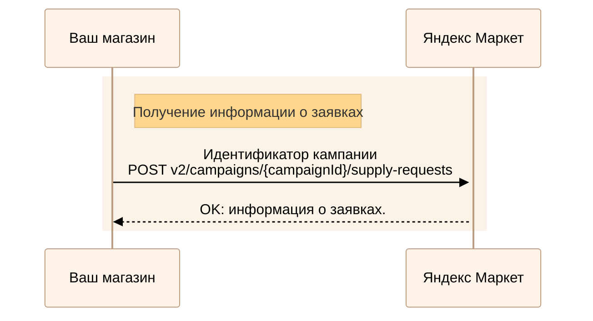
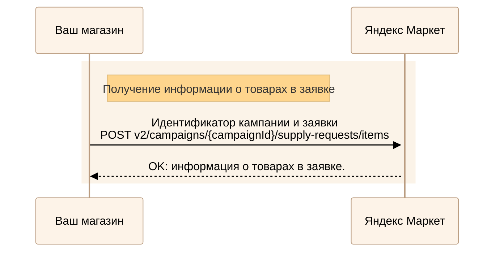
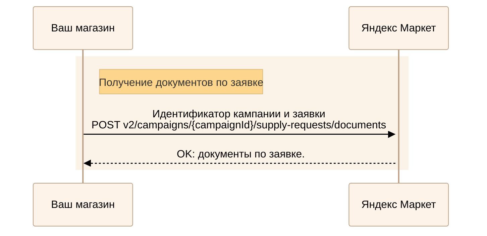

---
metadata:
  - name: generator
    content: Diplodoc Platform v5.57.4
alternate:
  - https://yandex.ru/dev/market/partner-api/doc/en/step-by-step/supplies.md
  - https://yandex.ru/dev/market/partner-api/doc/ru/step-by-step/supplies.md
  - https://yandex.ru/dev/market/partner-api/doc/zh/step-by-step/supplies.md
  - href: https://yandex.ru/dev/market/partner-api/doc/ru/step-by-step/supplies.md
    type: text/markdown
    title: Markdown version
  - href: https://yandex.ru/dev/market/partner-api/doc/ru/llms.txt
    rel: describedby
---
> **Documentation Index:** Fetch the complete configuration index at https://yandex.ru/dev/market/partner-api/doc/ru/llms.txt

# Заявки на поставку товаров на склад, вывоз или утилизацию

О том, как создать заявку и отвезти товары на склад, читайте в [Справке Маркета для продавцов](https://yandex.ru/support/marketplace/ru/storage/shipment/).

API Маркета позволяет:

* получать информацию:
    * о заявках на поставку, вывоз или утилизацию — [POST v2/campaigns/{campaignId}/supply-requests](https://yandex.ru/dev/market/partner-api/doc/ru/reference/supply-requests/getSupplyRequests.md);
    * о товарах в заявке — [POST v2/campaigns/{campaignId}/supply-requests/items](https://yandex.ru/dev/market/partner-api/doc/ru/reference/supply-requests/getSupplyRequestItems.md);
* скачивать документы по заявке — [POST v2/campaigns/{campaignId}/supply-requests/documents](https://yandex.ru/dev/market/partner-api/doc/ru/reference/supply-requests/getSupplyRequestDocuments.md);
* генерировать штрихкоды и присваивать их указанным товарам — [POST v1/businesses/{businessId}/offer-mappings/barcodes/generate](https://yandex.ru/dev/market/partner-api/doc/ru/reference/business-offer-mappings/generateOfferBarcodes.md);
* получать файл со штрикодами товаров в заявке, которые нужно приклеить на сам товар или непрозрачную упаковку, — [POST v1/reports/documents/barcodes/generate](https://yandex.ru/dev/market/partner-api/doc/ru/reference/reports/generateBarcodesReport.md).

## Получить информацию о заявках {#get-requests}

<!-- source: ru/_includes/mermaid/supplies-get-requests.md -->

<!-- endsource: ru/_includes/mermaid/supplies-get-requests.md -->

Выполните запрос [POST v2/campaigns/{campaignId}/supply-requests](https://yandex.ru/dev/market/partner-api/doc/ru/reference/supply-requests/getSupplyRequests.md), где укажите идентификатор кампании `campaignId` и необходимые параметры для фильтрации и сортировки.



Он может измениться.



### Какие бывают заявки {#request-types}

* Типы заявок:

    * `SUPPLY` — поставка товаров на склад;
    * `WITHDRAW` — вывоз товаров со склада;
    * `UTILIZATION ` — утилизация товаров.

    [Подтипы заявок](https://yandex.ru/dev/market/partner-api/doc/ru/reference/supply-requests/getSupplyRequests.md#supplyrequestsubtype)

* Родительская и дочерняя, если была:

    * поставка на склад хранения;
    * [мультипоставка](*multisupply);
    * дополнительная поставка;
    * утилизация или вывоз непринятых товаров.

    В этом случае вернутся параметры `parentLink` (ссылка на родительскую заявку) и `childrenLinks` (ссылки на дочерние заявки).

* В зависимости от логистики:

    * На поставки, которые едут сразу на склад хранения. Вернется параметр `targetLocation` — информация о складе хранения или ПВЗ.
    * С товарами, которые едут через транзитный склад. Вернется также параметр `transitLocation` — информация о транзитном складе или ПВЗ.

## Получить список товаров в заявке и информацию по ним {#get-items}

<!-- source: ru/_includes/mermaid/supplies-get-items.md -->

<!-- endsource: ru/_includes/mermaid/supplies-get-items.md -->

Выполните запрос [POST v2/campaigns/{campaignId}/supply-requests/items](https://yandex.ru/dev/market/partner-api/doc/ru/reference/supply-requests/getSupplyRequestItems.md), где укажите идентификатор кампании (`campaignId`) и заявки (`requestId`).

## Получить документы по заявке {#get-documents}

<!-- source: ru/_includes/mermaid/supplies-get-documents.md -->

<!-- endsource: ru/_includes/mermaid/supplies-get-documents.md -->

Выполните запрос [POST v2/campaigns/{campaignId}/supply-requests/documents](https://yandex.ru/dev/market/partner-api/doc/ru/reference/supply-requests/getSupplyRequestDocuments.md), где укажите идентификатор кампании (`campaignId`) и заявки (`requestId`).

## Может быть полезно {#read-more}

#|
|| **Отчет или метод API** | **Какую информацию дает**  ||

|| [Отчет по оборачиваемости](https://yandex.ru/dev/market/partner-api/doc/ru/reference/reports/generateGoodsTurnoverReport.md) |
Как ваши товары продаются cо складов Маркета.

Вовремя поставляйте на склад товары, которые заканчиваются, и забирайте те, которые раскупаются медленно. ||

|| [Отчет по движению товаров](https://yandex.ru/dev/market/partner-api/doc/ru/reference/reports/generateGoodsMovementReport.md) | Сколько товаров поставлено, заказано, возвращено покупателями, перемещено на другой склад или вывезено вами. ||

|| [Отчет по остаткам на складах](https://yandex.ru/dev/market/partner-api/doc/ru/reference/reports/generateStocksOnWarehousesReport.md) | Остатки товаров на всех складах Маркета, а также сколько товаров доступны к заказу, сколько товаров с браком и т.д. ||
|| [Индекс качества магазинов](https://yandex.ru/dev/market/partner-api/doc/ru/reference/ratings/getQualityRatings.md) | Значение индекса качества магазинов и его составляющие. ||
|#

[*multisupply]:
О том, что это такое, читайте в [Справке Маркета для продавцов](https://yandex.ru/support/marketplace/ru/storage/shipment/application#create).
