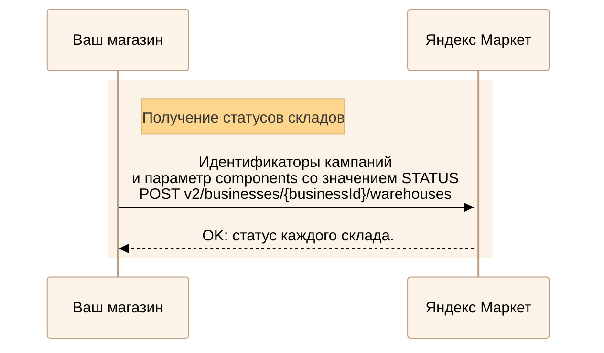
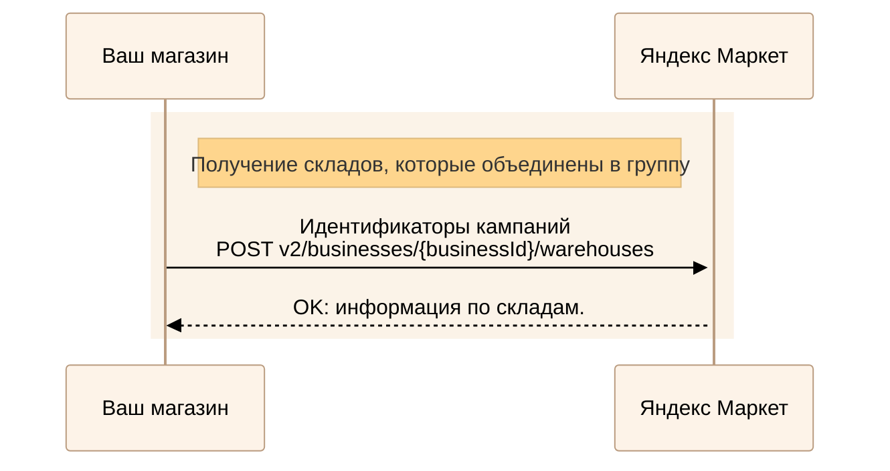

---
metadata:
  - name: generator
    content: Diplodoc Platform v5.61.0
alternate:
  - https://yandex.ru/dev/market/partner-api/doc/en/step-by-step/warehouses.md
  - https://yandex.ru/dev/market/partner-api/doc/ru/step-by-step/warehouses.md
  - https://yandex.ru/dev/market/partner-api/doc/zh/step-by-step/warehouses.md
  - href: https://yandex.ru/dev/market/partner-api/doc/ru/step-by-step/warehouses.md
    type: text/markdown
    title: Markdown version
  - href: https://yandex.ru/dev/market/partner-api/doc/ru/llms.txt
    rel: describedby
---
> **Documentation Index:** Fetch the complete configuration index at https://yandex.ru/dev/market/partner-api/doc/ru/llms.txt

# Работа со складами

API Маркета позволяет получать информацию по складам, а также отключать их или отдельные модели работы, чтобы временно скрыть товары с витрины, и включать обратно.

## Получить список складов {#partner-warehouses}

Если в кабинете нет групп складов, выполните запрос [POST v3/businesses/{businessId}/warehouses](https://yandex.ru/dev/market/partner-api/doc/ru/reference/warehouses/getPartnerWarehouses.md).

Метод вернет список складов кабинета, модели работы (FBS, DBS, Экспресс) и доступность API для каждой модели.



Если в кабинете есть группы складов, используйте [POST v2/businesses/{businessId}/warehouses](https://yandex.ru/dev/market/partner-api/doc/ru/reference/warehouses/getPagedWarehouses.md). [Что такое группы складов и зачем они нужны](https://yandex.ru/support/marketplace/assortment/operations/stocks.html#unified-stocks).



## Узнать статусы складов {#status}

<!-- source: ru/_includes/mermaid/warehouse-status.md -->

<!-- endsource: ru/_includes/mermaid/warehouse-status.md -->

Если в кабинете есть группы складов, выполните запрос [POST v2/businesses/{businessId}/warehouses](https://yandex.ru/dev/market/partner-api/doc/ru/reference/warehouses/getPagedWarehouses.md), где укажите:

* идентификаторы кампаний — `campaignIds`;
* свойство склада — параметр `components` со значением `STATUS`.

Если в кабинете нет групп складов, статусы моделей работы можно получить в ответе метода [POST v3/businesses/{businessId}/warehouses](https://yandex.ru/dev/market/partner-api/doc/ru/reference/warehouses/getPartnerWarehouses.md).

## Узнать группы складов для передачи остатков {#group}

Если склады объединены в группу, нужно передавать остатки только для **одного любого** склада — информация для остальных складов в этой группе обновится автоматически. [Что такое группы складов и зачем они нужны](https://yandex.ru/support/marketplace/ru/assortment/operations/stocks.html#unified-stocks)

<!-- source: ru/_includes/mermaid/warehouse-group.md -->

<!-- endsource: ru/_includes/mermaid/warehouse-group.md -->

Чтобы узнать, какие склады объединены в группу, получите информацию по всем складам. Для этого выполните запрос [POST v2/businesses/{businessId}/warehouses](https://yandex.ru/dev/market/partner-api/doc/ru/reference/warehouses/getPagedWarehouses.md), где укажите идентификаторы кампаний — `campaignIds`. Параметр `components` передавать не нужно.

Если в ответе у склада:

* Нет параметра `groupInfo` — он не находится в группе. Передайте остатки, указав идентификатор кампании того магазина, который связан со складом.
* Вернулся параметр `groupInfo` — склад объединен в группу. Склады с одинаковым `id` в `WarehouseGroupInfoDTO` входят в одну группу. Передайте остатки, указав идентификатор кампании любого магазина в этой группе.

[Как передать остатки](https://yandex.ru/dev/market/partner-api/doc/ru/step-by-step/stocks.md)

## Отключить или включить модель работы склада {#update-model-status}

Если нужно скрыть или вернуть на витрину товары только одной модели работы (FBS, DBS или Экспресс), выполните запрос [POST v3/businesses/{businessId}/warehouse/models/status](https://yandex.ru/dev/market/partner-api/doc/ru/reference/warehouses/updateWarehouseModelStatus.md).

В запросе передайте:

* идентификатор склада — `partnerWarehouseId`;
* модель работы — `model`;
* статус — `enabled` со значением `false`, чтобы отключить, или `true`, чтобы включить.

После отключения модели товары, которые работают по ней на данном складе, скрываются через 15 минут. После включения они возвращаются на витрину через 15 минут, а если модель была выключена 30 дней или дольше — через 4 часа.



Включить её вручную с помощью этого метода не получится.


